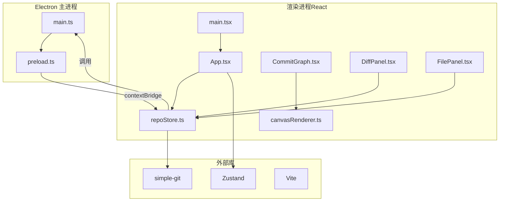
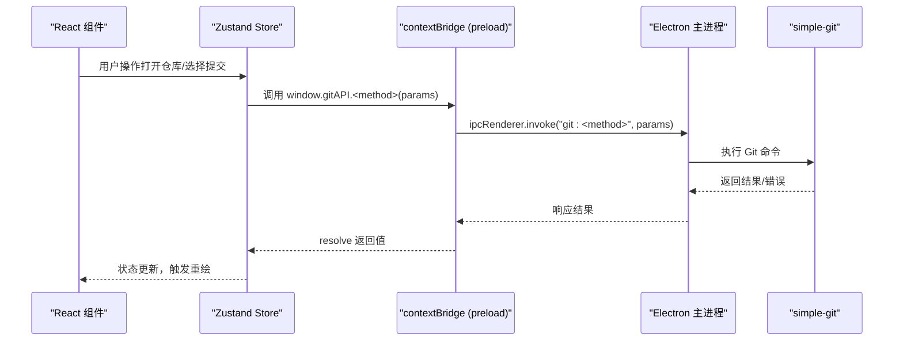
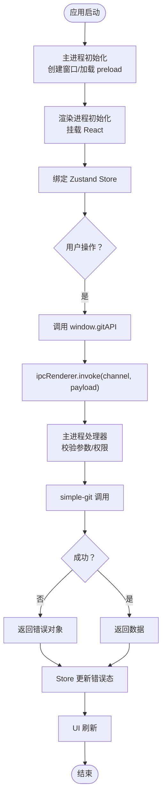
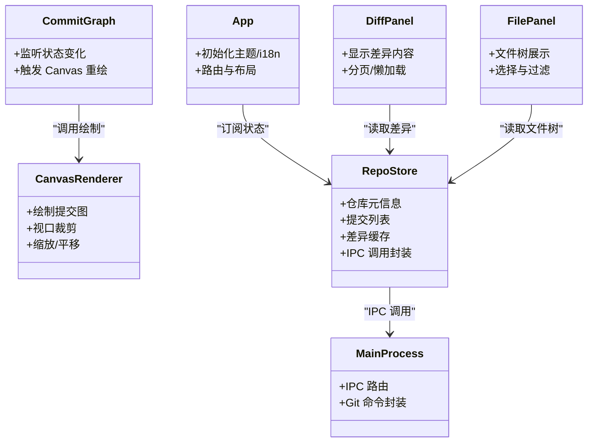
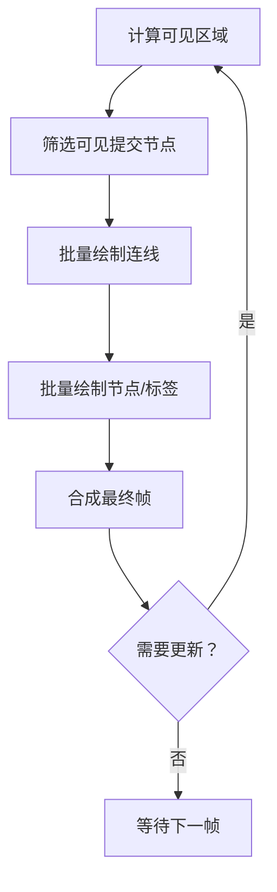
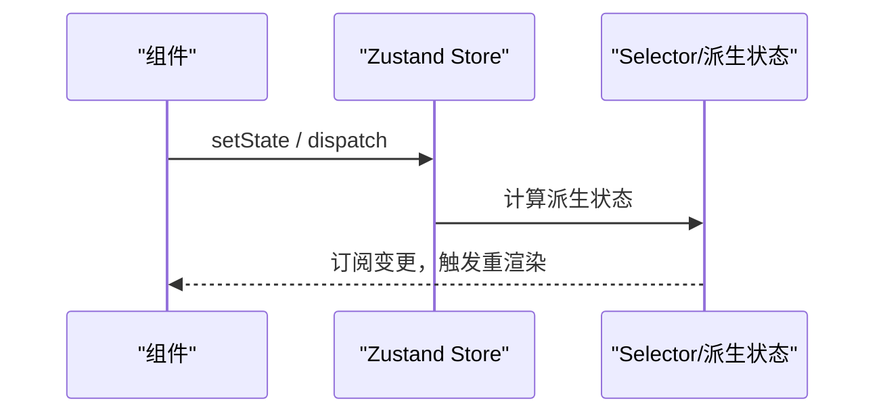
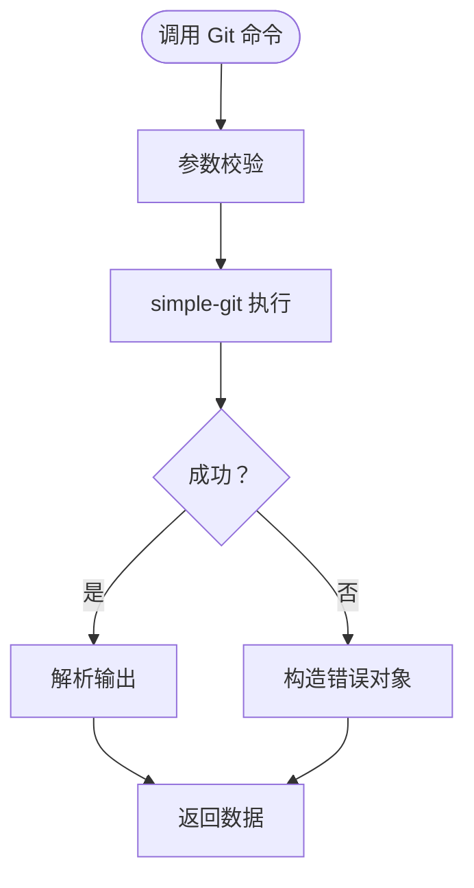
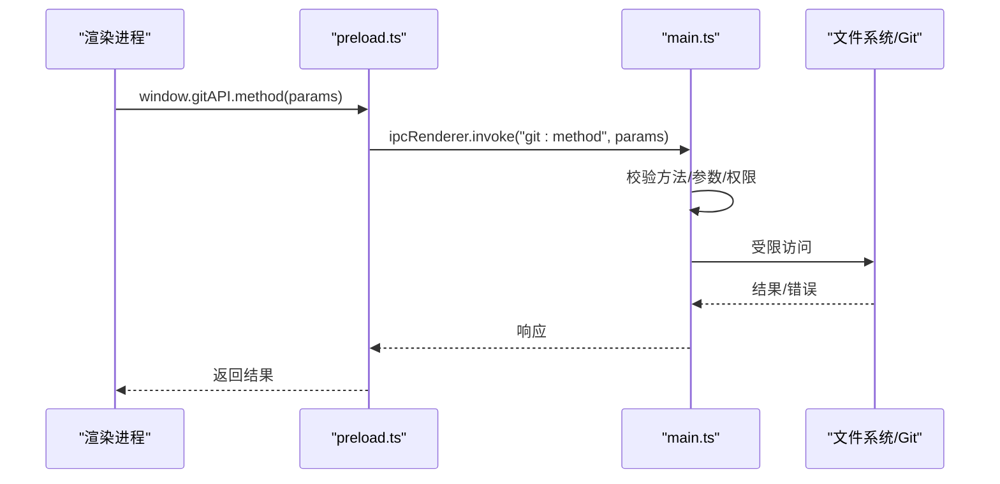
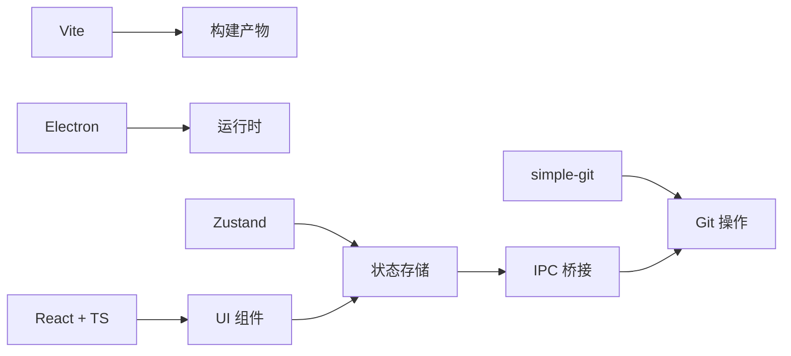

# 架构

<cite>
**本文引用的文件**   
- [electron/main.ts](file://electron/main.ts)
- [electron/preload.ts](file://electron/preload.ts)
- [src/renderer/canvasRenderer.ts](file://src/renderer/canvasRenderer.ts)
- [src/application/repoStore.ts](file://src/application/repoStore.ts)
- [src/components/CommitGraph.tsx](file://src/components/CommitGraph.tsx)
- [src/components/DiffPanel.tsx](file://src/components/DiffPanel.tsx)
- [src/components/FilePanel.tsx](file://src/components/FilePanel.tsx)
- [src/App.tsx](file://src/App.tsx)
- [src/main.tsx](file://src/main.tsx)
- [package.json](file://package.json)
- [wiki/IPC-API.md](file://wiki/IPC-API.md)
- [wiki/Canvas-Renderer.md](file://wiki/Canvas-Renderer.md)
- [wiki/State-Management.md](file://wiki/State-Management.md)
</cite>

## 目录
1. [简介](#简介)
2. [项目结构](#项目结构)
3. [核心组件](#核心组件)
4. [架构总览](#架构总览)
5. [详细组件分析](#详细组件分析)
6. [依赖关系分析](#依赖关系分析)
7. [性能考量](#性能考量)
8. [故障排查指南](#故障排查指南)
9. [结论](#结论)

## 简介
本文件面向“高层系统设计”，聚焦双进程架构、IPC 数据流、模块边界与关键设计决策（Canvas 替代 SVG、Zustand 替代 Redux、simple-git 替代 nodegit），并阐述安全模型。文档以仓库现有实现为依据，结合 wiki 中的说明进行系统化梳理，帮助读者快速把握整体结构与运行方式。

## 项目结构
- Electron 主进程：负责系统级能力与 Git 操作，通过 preload 暴露安全的 IPC API。
- React 渲染进程：基于 Vite + TypeScript 构建，使用 Zustand 管理状态，Canvas 2D 绘制提交图，组件化 UI。
- Wiki 文档：包含 IPC、Canvas 渲染、状态管理等专题说明。

**图表来源**
- [electron/main.ts](file://electron/main.ts)
- [electron/preload.ts](file://electron/preload.ts)
- [src/App.tsx](file://src/App.tsx)
- [src/main.tsx](file://src/main.tsx)
- [src/application/repoStore.ts](file://src/application/repoStore.ts)
- [src/components/CommitGraph.tsx](file://src/components/CommitGraph.tsx)
- [src/components/DiffPanel.tsx](file://src/components/DiffPanel.tsx)
- [src/components/FilePanel.tsx](file://src/components/FilePanel.tsx)
- [src/renderer/canvasRenderer.ts](file://src/renderer/canvasRenderer.ts)
- [package.json](file://package.json)

**章节来源**
- [package.json](file://package.json)
- [wiki/IPC-API.md](file://wiki/IPC-API.md)
- [wiki/Canvas-Renderer.md](file://wiki/Canvas-Renderer.md)
- [wiki/State-Management.md](file://wiki/State-Management.md)

## 核心组件
- 主进程（main.ts）
  - 职责：启动应用窗口、注册 IPC 通道、封装 simple-git 调用、处理文件系统与 Git 命令。
  - 关键点：仅暴露必要方法；错误统一返回；避免直接暴露 Node 原生 API。
- 预加载脚本（preload.ts）
  - 职责：通过 contextBridge 暴露 window.gitAPI，限定可访问的 IPC 方法与参数类型。
  - 关键点：最小权限原则，白名单式暴露。
- 状态管理（repoStore.ts）
  - 职责：维护仓库元信息、提交列表、选中文件、差异结果等；协调 UI 更新。
  - 关键点：使用 Zustand 订阅/派发；将 Git 操作与 UI 解耦；提供持久化或缓存策略接口。
- 渲染器（canvasRenderer.ts）
  - 职责：在 Canvas 2D 上绘制提交图，支持视口裁剪、缩放、滚动。
  - 关键点：批量绘制、离屏缓冲、按需重绘，保障万级提交流畅度。
- 组件层（CommitGraph.tsx、DiffPanel.tsx、FilePanel.tsx）
  - 职责：分别展示提交图、差异面板、文件树；读取 Zustand 状态并触发用户交互。
  - 关键点：受控组件模式；事件回调回写 store；懒加载大文本差异。

**章节来源**
- [electron/main.ts](file://electron/main.ts)
- [electron/preload.ts](file://electron/preload.ts)
- [src/application/repoStore.ts](file://src/application/repoStore.ts)
- [src/renderer/canvasRenderer.ts](file://src/renderer/canvasRenderer.ts)
- [src/components/CommitGraph.tsx](file://src/components/CommitGraph.tsx)
- [src/components/DiffPanel.tsx](file://src/components/DiffPanel.tsx)
- [src/components/FilePanel.tsx](file://src/components/FilePanel.tsx)

## 架构总览
双进程架构与安全边界：
- 渲染进程无 nodeIntegration，启用 contextIsolation，禁止直接访问 Node/Git。
- 所有 Git 操作经 preload 暴露的 window.gitAPI 转发至主进程，由 main.ts 调用 simple-git。
- 数据流单向：UI → Store → IPC → Main → Git → IPC → Store → UI。

**图表来源**
- [electron/preload.ts](file://electron/preload.ts)
- [electron/main.ts](file://electron/main.ts)
- [src/application/repoStore.ts](file://src/application/repoStore.ts)
- [src/components/CommitGraph.tsx](file://src/components/CommitGraph.tsx)
- [src/components/DiffPanel.tsx](file://src/components/DiffPanel.tsx)
- [src/components/FilePanel.tsx](file://src/components/FilePanel.tsx)

## 详细组件分析

### 双进程与 IPC 数据流
- 入口与初始化
  - 渲染进程入口：main.tsx 挂载 React 应用。
  - 主进程入口：main.ts 创建 BrowserWindow 并加载 preload。
- IPC 契约
  - preload 暴露 window.gitAPI，限定方法名与参数结构。
  - 主进程监听对应 channel，路由到具体 Git 服务函数。
- 错误与日志
  - 主进程捕获异常并返回结构化错误对象；渲染进程统一处理提示。

**图表来源**
- [src/main.tsx](file://src/main.tsx)
- [electron/main.ts](file://electron/main.ts)
- [electron/preload.ts](file://electron/preload.ts)
- [src/application/repoStore.ts](file://src/application/repoStore.ts)

**章节来源**
- [wiki/IPC-API.md](file://wiki/IPC-API.md)
- [electron/preload.ts](file://electron/preload.ts)
- [electron/main.ts](file://electron/main.ts)
- [src/application/repoStore.ts](file://src/application/repoStore.ts)

### 模块边界与职责划分
- 渲染进程
  - App.tsx：应用壳、主题与 i18n 配置、全局布局。
  - 组件：CommitGraph.tsx（提交图）、DiffPanel.tsx（差异）、FilePanel.tsx（文件树）。
  - 渲染器：canvasRenderer.ts（Canvas 2D 绘制逻辑）。
  - 状态：repoStore.ts（仓库状态、异步流程编排）。
- 主进程
  - main.ts：IPC 路由、Git 封装、资源路径与打包产物处理。
- 外部依赖
  - simple-git：Git 操作。
  - Zustand：轻量状态管理。
  - Vite：构建与开发体验。

**图表来源**
- [src/App.tsx](file://src/App.tsx)
- [src/components/CommitGraph.tsx](file://src/components/CommitGraph.tsx)
- [src/components/DiffPanel.tsx](file://src/components/DiffPanel.tsx)
- [src/components/FilePanel.tsx](file://src/components/FilePanel.tsx)
- [src/renderer/canvasRenderer.ts](file://src/renderer/canvasRenderer.ts)
- [src/application/repoStore.ts](file://src/application/repoStore.ts)
- [electron/main.ts](file://electron/main.ts)

**章节来源**
- [src/App.tsx](file://src/App.tsx)
- [src/components/CommitGraph.tsx](file://src/components/CommitGraph.tsx)
- [src/components/DiffPanel.tsx](file://src/components/DiffPanel.tsx)
- [src/components/FilePanel.tsx](file://src/components/FilePanel.tsx)
- [src/renderer/canvasRenderer.ts](file://src/renderer/canvasRenderer.ts)
- [src/application/repoStore.ts](file://src/application/repoStore.ts)
- [electron/main.ts](file://electron/main.ts)

### 关键设计决策

#### Canvas 替代 SVG
- 动机：提交图节点与连线规模可达万级，SVG DOM 开销过大导致卡顿。
- 方案：Canvas 2D 批量绘制、视口裁剪、离屏缓冲、按需重绘。
- 收益：帧率稳定、内存占用可控、交互延迟低。

**图表来源**
- [src/renderer/canvasRenderer.ts](file://src/renderer/canvasRenderer.ts)
- [wiki/Canvas-Renderer.md](file://wiki/Canvas-Renderer.md)

**章节来源**
- [wiki/Canvas-Renderer.md](file://wiki/Canvas-Renderer.md)
- [src/renderer/canvasRenderer.ts](file://src/renderer/canvasRenderer.ts)

#### Zustand 替代 Redux
- 动机：Redux 样板代码多、学习成本高；Zustand 更简洁、订阅粒度细。
- 方案：单一 store 管理仓库状态，按字段拆分 selector，减少不必要重渲染。
- 收益：开发效率提升、运行时开销更低、调试更直观。

**图表来源**
- [src/application/repoStore.ts](file://src/application/repoStore.ts)
- [wiki/State-Management.md](file://wiki/State-Management.md)

**章节来源**
- [wiki/State-Management.md](file://wiki/State-Management.md)
- [src/application/repoStore.ts](file://src/application/repoStore.ts)

#### simple-git 替代 nodegit
- 动机：nodegit 编译复杂、体积大；simple-git 轻量、易集成、生态成熟。
- 方案：在主进程封装常用 Git 命令，统一错误码与日志。
- 收益：构建更快、部署更简单、维护成本更低。

**图表来源**
- [electron/main.ts](file://electron/main.ts)

**章节来源**
- [electron/main.ts](file://electron/main.ts)

### 安全模型
- 渲染进程隔离：nodeIntegration:false、contextIsolation:true，禁止直接访问 Node/Git。
- 最小权限暴露：preload 仅暴露 window.gitAPI 白名单方法，严格参数校验。
- 主进程守卫：对每个 IPC 通道做权限与输入校验，拒绝非法请求。
- 资源访问控制：限制文件系统访问范围，避免越权读取。

**图表来源**
- [electron/preload.ts](file://electron/preload.ts)
- [electron/main.ts](file://electron/main.ts)

**章节来源**
- [electron/preload.ts](file://electron/preload.ts)
- [electron/main.ts](file://electron/main.ts)

## 依赖关系分析
- 构建与运行
  - Vite：开发与构建。
  - Electron：双进程框架。
  - React + TypeScript：前端栈。
  - Zustand：状态管理。
  - simple-git：Git 操作。
- 模块耦合
  - 渲染进程与主进程通过 IPC 松耦合。
  - 组件仅依赖 Store，不直接依赖 IPC。
  - Canvas 渲染器独立于 UI 组件，便于复用与测试。

**图表来源**
- [package.json](file://package.json)
- [src/application/repoStore.ts](file://src/application/repoStore.ts)
- [electron/main.ts](file://electron/main.ts)

**章节来源**
- [package.json](file://package.json)
- [src/application/repoStore.ts](file://src/application/repoStore.ts)
- [electron/main.ts](file://electron/main.ts)

## 性能考量
- 提交图渲染
  - 视口裁剪：仅绘制可见区域，降低绘制量。
  - 批量绘制：合并绘制指令，减少上下文切换。
  - 离屏缓冲：复杂场景下使用离屏 Canvas 缓存。
- 状态更新
  - 细粒度订阅：仅更新受影响组件。
  - 差异缓存：避免重复计算与网络/磁盘 IO。
- I/O 与并发
  - 主进程串行化 Git 命令，避免竞争条件。
  - 大文件差异懒加载与分页。

[本节为通用指导，无需特定文件引用]

## 故障排查指南
- IPC 调用失败
  - 检查 preload 是否暴露对应方法；确认主进程是否监听该 channel。
  - 查看主进程日志与错误对象结构。
- 提交图卡顿
  - 确认视口裁剪逻辑生效；检查是否频繁全量重绘。
  - 评估节点数量与层级深度，必要时增加分页或简化样式。
- 状态不同步
  - 检查 Store 订阅是否正确；确认异步流程未丢失状态更新。
- 权限与安全问题
  - 复核 preload 白名单；验证主进程参数校验与路径限制。

**章节来源**
- [electron/preload.ts](file://electron/preload.ts)
- [electron/main.ts](file://electron/main.ts)
- [src/application/repoStore.ts](file://src/application/repoStore.ts)
- [src/renderer/canvasRenderer.ts](file://src/renderer/canvasRenderer.ts)

## 结论
本系统采用清晰的双进程架构与严格的 IPC 边界，确保安全性与可维护性。通过 Canvas 2D 渲染提交图、Zustand 管理状态、simple-git 封装 Git 操作，实现了高性能与低复杂度的平衡。模块边界明确、数据流单向，便于扩展与优化。建议持续完善错误处理、日志与监控，进一步提升稳定性与可观测性。