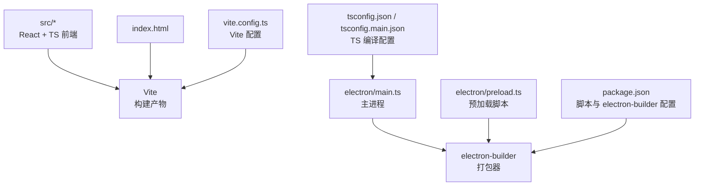
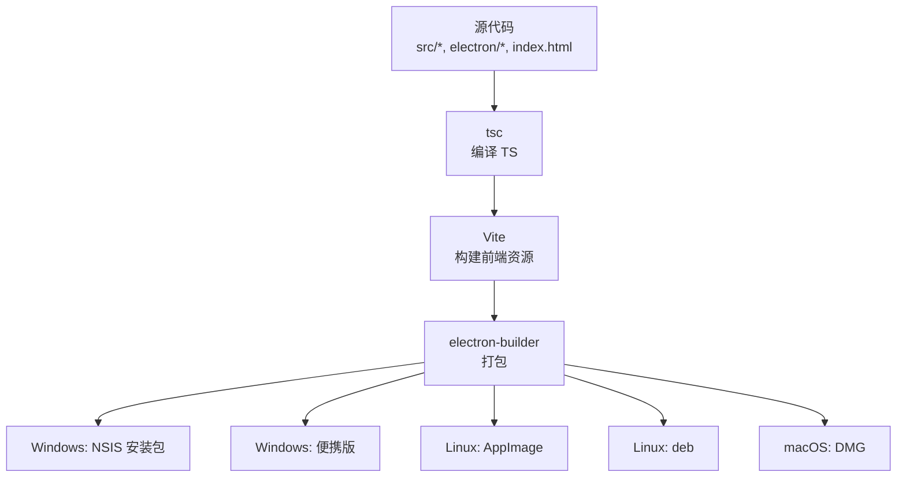
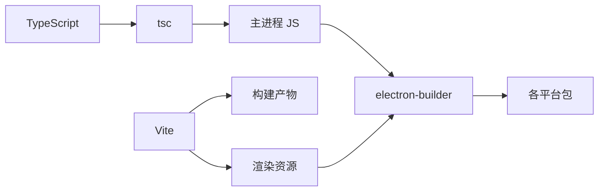

# 构建与打包

<cite>
**本文引用的文件**   
- [package.json](file://package.json)
- [vite.config.ts](file://vite.config.ts)
- [tsconfig.json](file://tsconfig.json)
- [tsconfig.main.json](file://tsconfig.main.json)
- [electron/main.ts](file://electron/main.ts)
- [electron/preload.ts](file://electron/preload.ts)
- [index.html](file://index.html)
- [README.md](file://README.md)
- [wiki/Build-and-Packaging.md](file://wiki/Build-and-Packaging.md)
</cite>

## 目录
1. [简介](#简介)
2. [项目结构](#项目结构)
3. [核心组件](#核心组件)
4. [架构总览](#架构总览)
5. [详细组件分析](#详细组件分析)
6. [依赖分析](#依赖分析)
7. [性能考虑](#性能考虑)
8. [故障排查指南](#故障排查指南)
9. [结论](#结论)
10. [附录](#附录)

## 简介
本章节聚焦生产构建流水线：TypeScript 编译（tsc）+ Vite 构建前端，配合 electron-builder 完成跨平台打包。文档覆盖 Windows（NSIS 安装包与便携版）、Linux（AppImage、deb）、macOS（DMG）产物；说明 NSIS 特性、开发环境与生产环境的差异、运行时依赖与系统要求。

## 项目结构
- 前端源码位于 src，使用 React + TypeScript，通过 Vite 进行开发与构建。
- Electron 主进程与预加载脚本位于 electron 目录。
- 构建配置集中在 package.json、vite.config.ts、tsconfig*.json。
- 入口 HTML 为 index.html。
- 相关构建与打包说明亦在 wiki/Build-and-Packaging.md。

图表来源
- [package.json](file://package.json)
- [vite.config.ts](file://vite.config.ts)
- [tsconfig.json](file://tsconfig.json)
- [tsconfig.main.json](file://tsconfig.main.json)
- [electron/main.ts](file://electron/main.ts)
- [electron/preload.ts](file://electron/preload.ts)
- [index.html](file://index.html)

章节来源
- [package.json](file://package.json)
- [vite.config.ts](file://vite.config.ts)
- [tsconfig.json](file://tsconfig.json)
- [tsconfig.main.json](file://tsconfig.main.json)
- [electron/main.ts](file://electron/main.ts)
- [electron/preload.ts](file://electron/preload.ts)
- [index.html](file://index.html)
- [wiki/Build-and-Packaging.md](file://wiki/Build-and-Packaging.md)

## 核心组件
- 构建工具链
  - tsc：将 TypeScript 编译为 JavaScript（主进程与预加载脚本）。
  - Vite：构建前端资源（HTML/CSS/JS），优化与压缩。
  - electron-builder：根据配置生成各平台安装包与可执行文件。
- 关键配置文件
  - package.json：定义构建脚本、electron-builder 配置、平台产物类型等。
  - vite.config.ts：Vite 构建选项（如输出目录、资源处理、环境变量注入等）。
  - tsconfig.json / tsconfig.main.json：分别控制渲染进程与主进程的 TS 编译选项。
  - index.html：应用入口页面。
- 运行期要点
  - 主进程通过 simple-git 调用 Git 命令。
  - 渲染进程通过 contextBridge IPC（window.gitAPI）与主进程通信。
  - 安全基线：nodeIntegration:false，contextIsolation:true。

章节来源
- [package.json](file://package.json)
- [vite.config.ts](file://vite.config.ts)
- [tsconfig.json](file://tsconfig.json)
- [tsconfig.main.json](file://tsconfig.main.json)
- [electron/main.ts](file://electron/main.ts)
- [electron/preload.ts](file://electron/preload.ts)
- [index.html](file://index.html)

## 架构总览
下图展示从源码到最终产物的端到端流程，以及各阶段的关键输入/输出。

图表来源
- [package.json](file://package.json)
- [vite.config.ts](file://vite.config.ts)
- [tsconfig.json](file://tsconfig.json)
- [tsconfig.main.json](file://tsconfig.main.json)
- [electron/main.ts](file://electron/main.ts)
- [electron/preload.ts](file://electron/preload.ts)
- [index.html](file://index.html)

## 详细组件分析

### 构建流水线（tsc + Vite + electron-builder）
- 步骤
  - 使用 tsc 编译 TypeScript（区分主进程与渲染进程配置）。
  - 使用 Vite 构建前端静态资源（HTML/CSS/JS），并注入必要的环境变量。
  - 使用 electron-builder 读取 package.json 中的配置，生成各平台产物。
- 关键点
  - 确保主进程与预加载脚本的 TS 编译目标与 Electron 运行时兼容。
  - Vite 构建产物需被 electron-builder 正确引用。
  - 按需启用代码压缩、资源哈希、分包等优化策略。

章节来源
- [package.json](file://package.json)
- [vite.config.ts](file://vite.config.ts)
- [tsconfig.json](file://tsconfig.json)
- [tsconfig.main.json](file://tsconfig.main.json)

### electron-builder 配置与产物
- 配置位置
  - 通常在 package.json 中通过 build 字段声明。
- 平台产物
  - Windows：NSIS 安装包、便携版。
  - Linux：AppImage、deb。
  - macOS：DMG。
- 常见能力
  - 图标、许可证、安装后启动项、卸载程序、签名与公证（macOS）。
  - 外部依赖（如 native 模块）自动处理或手动指定。

章节来源
- [package.json](file://package.json)
- [wiki/Build-and-Packaging.md](file://wiki/Build-and-Packaging.md)

### NSIS 特性（Windows）
- 典型功能
  - 自定义安装向导界面与步骤。
  - 安装前检查（如 .NET、Git 路径）。
  - 注册表写入、快捷方式创建、开机自启开关。
  - 多语言支持、安装目录选择、权限提升提示。
- 集成方式
  - 通过 electron-builder 的 nsis 配置段注入脚本或模板。

章节来源
- [package.json](file://package.json)
- [wiki/Build-and-Packaging.md](file://wiki/Build-and-Packaging.md)

### 开发 vs 生产差异
- 开发环境
  - 使用 Vite 开发服务器，热重载。
  - 主进程通常由 electron 直接运行，便于调试。
  - 不启用代码压缩与资源优化。
- 生产环境
  - 先 tsc 编译，再 Vite 构建，最后 electron-builder 打包。
  - 启用压缩、资源哈希、Tree Shaking 等优化。
  - 产物为独立安装包或可分发格式。

章节来源
- [package.json](file://package.json)
- [vite.config.ts](file://vite.config.ts)

### 运行时依赖与系统要求
- 运行时依赖
  - Node.js（构建时）与 Electron 运行时（打包后内嵌）。
  - Git 客户端（用于 simple-git 调用）。
  - 平台特定库（如 Linux 的 FUSE 用于 AppImage）。
- 系统要求
  - Windows 10/11（视 Electron 版本而定）。
  - Linux 发行版内核与桌面环境满足 AppImage/deb 运行需求。
  - macOS 版本需满足 Electron 最低支持要求。

章节来源
- [package.json](file://package.json)
- [README.md](file://README.md)
- [wiki/Build-and-Packaging.md](file://wiki/Build-and-Packaging.md)

## 依赖分析
- 构建期依赖
  - typescript（tsc）
  - vite（前端构建）
  - electron-builder（打包）
- 运行期依赖
  - Electron（内嵌于产物）
  - simple-git（Git 操作）
  - 平台原生依赖（如 AppImage 所需 FUSE）

图表来源
- [package.json](file://package.json)
- [vite.config.ts](file://vite.config.ts)
- [tsconfig.json](file://tsconfig.json)
- [tsconfig.main.json](file://tsconfig.main.json)

章节来源
- [package.json](file://package.json)
- [vite.config.ts](file://vite.config.ts)
- [tsconfig.json](file://tsconfig.json)
- [tsconfig.main.json](file://tsconfig.main.json)

## 性能考虑
- 构建性能
  - 合理设置 Vite 的分包与缓存策略。
  - 仅编译必要的 TS 源文件（按入口划分）。
- 运行性能
  - 避免在主进程执行重计算任务。
  - 渲染进程使用 Canvas 2D 视图裁剪，减少绘制开销。
- 包体积
  - 启用压缩与 Tree Shaking。
  - 移除未使用的依赖与资源。

[本节为通用指导，无需具体文件引用]

## 故障排查指南
- 常见问题
  - 构建失败：检查 Node/Electron/TypeScript/Vite/electron-builder 版本兼容性。
  - 打包失败：确认平台 SDK、签名证书、FUSE（Linux）是否就绪。
  - 运行异常：验证 Git 路径、权限、环境变量是否正确注入。
- 定位方法
  - 查看构建日志与 electron-builder 输出。
  - 在开发模式逐步验证主进程与渲染进程通信。
  - 使用最小化复现用例隔离问题。

章节来源
- [package.json](file://package.json)
- [wiki/Build-and-Packaging.md](file://wiki/Build-and-Packaging.md)

## 结论
本项目采用“tsc + Vite + electron-builder”的标准生产构建流水线，覆盖 Windows（NSIS/portable）、Linux（AppImage/deb）、macOS（DMG）全平台产物。通过严格的 TS 编译与 Vite 优化，结合 electron-builder 的灵活打包能力，可实现稳定、高效、可分发的桌面应用发布。建议在 CI 中固化构建步骤，统一依赖版本与环境，确保跨平台一致性。

[本节为总结性内容，无需具体文件引用]

## 附录
- 快速参考
  - 构建脚本与打包参数以 package.json 为准。
  - Vite 行为受 vite.config.ts 控制。
  - TS 编译选项见 tsconfig.json 与 tsconfig.main.json。
- 扩展阅读
  - wiki/Build-and-Packaging.md 提供更详细的构建与打包说明。

章节来源
- [package.json](file://package.json)
- [vite.config.ts](file://vite.config.ts)
- [tsconfig.json](file://tsconfig.json)
- [tsconfig.main.json](file://tsconfig.main.json)
- [wiki/Build-and-Packaging.md](file://wiki/Build-and-Packaging.md)