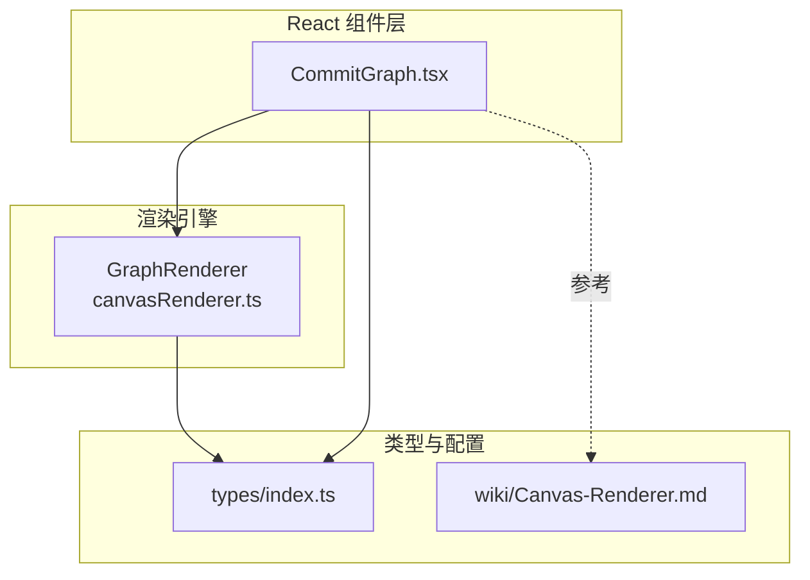
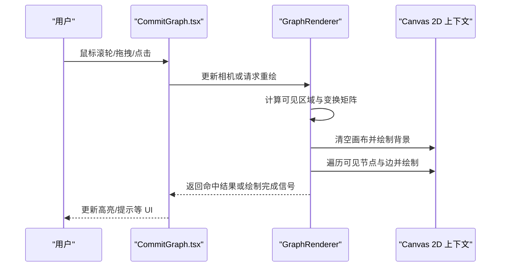
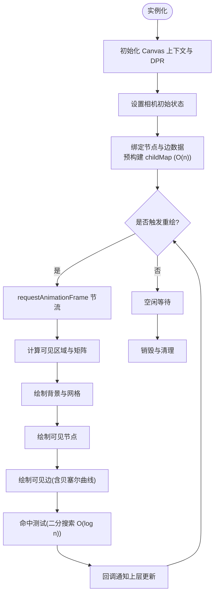
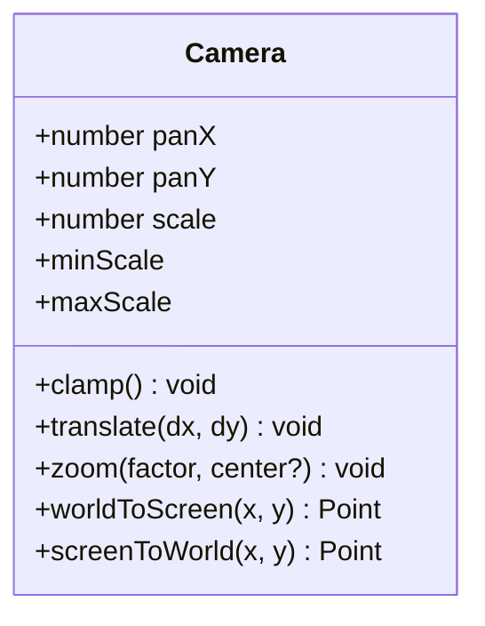
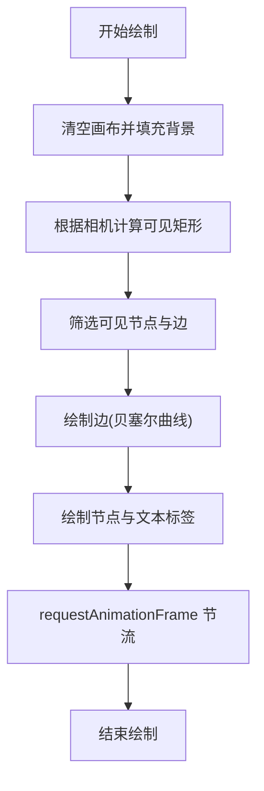
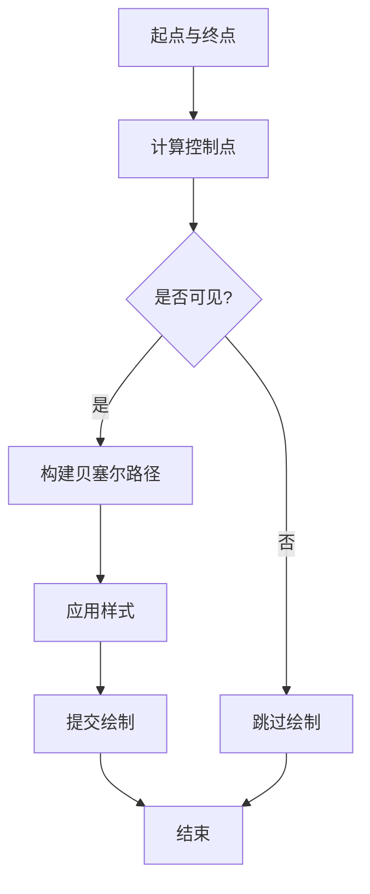
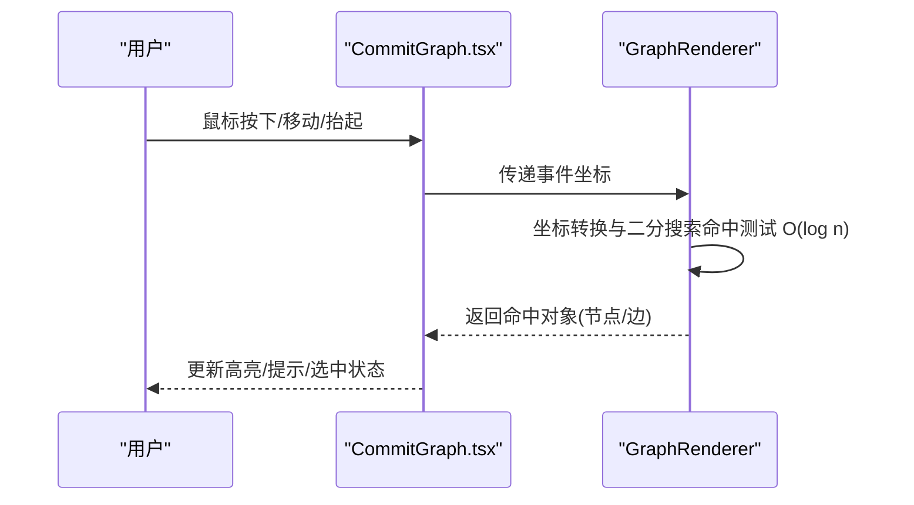
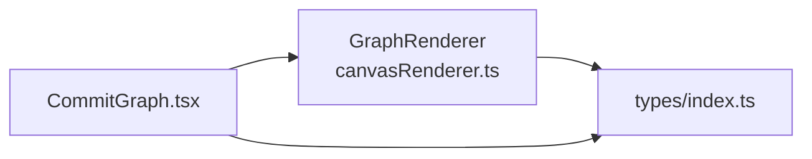

# 画布渲染器

<cite>
**本文引用的文件**   
- [canvasRenderer.ts](file://src/renderer/canvasRenderer.ts)
- [CommitGraph.tsx](file://src/components/CommitGraph.tsx)
- [index.ts](file://src/types/index.ts)
- [Canvas-Renderer.md](file://wiki/Canvas-Renderer.md)
</cite>

## 更新摘要
**所做更改**
- 新增了 requestAnimationFrame 节流机制的详细说明，实现更流畅的动画效果
- 更新了命中测试算法，采用二分搜索实现 O(log n) 复杂度
- 增强了交互操作期间的 CPU 使用优化描述
- 完善了性能考量章节，突出新的性能优化技术

## 目录
1. [简介](#简介)
2. [项目结构](#项目结构)
3. [核心组件](#核心组件)
4. [架构总览](#架构总览)
5. [详细组件分析](#详细组件分析)
6. [依赖关系分析](#依赖关系分析)
7. [性能考量](#性能考量)
8. [故障排查指南](#故障排查指南)
9. [结论](#结论)
10. [附录](#附录)

## 简介
本文件聚焦于 ZenTree 的 Canvas 渲染引擎内部实现，围绕 GraphRenderer 类生命周期、相机系统（平移/缩放/DPR）、渲染管线、视口裁剪、贝塞尔边绘制、命中测试、交互事件与布局常量进行系统化说明。该渲染器基于 HTML5 Canvas 2D 构建，支持在万级提交节点场景下的流畅交互与高性能绘制。

**最新更新**：通过引入 requestAnimationFrame 节流机制和二分搜索算法，实现了更流畅的动画效果和 O(log n) 复杂度的命中测试，显著提升了大规模数据集的交互性能。

## 项目结构
- 渲染器核心位于 src/renderer/canvasRenderer.ts，封装 GraphRenderer 类及绘制逻辑。
- React 组件层通过 src/components/CommitGraph.tsx 管理 Canvas 元素与事件绑定，驱动渲染器更新。
- 类型定义集中于 src/types/index.ts，为渲染器提供数据结构契约。
- wiki/Canvas-Renderer.md 提供渲染器设计背景与使用要点。

图表来源
- [canvasRenderer.ts](file://src/renderer/canvasRenderer.ts)
- [CommitGraph.tsx](file://src/components/CommitGraph.tsx)
- [index.ts](file://src/types/index.ts)
- [Canvas-Renderer.md](file://wiki/Canvas-Renderer.md)

章节来源
- [canvasRenderer.ts](file://src/renderer/canvasRenderer.ts)
- [CommitGraph.tsx](file://src/components/CommitGraph.tsx)
- [index.ts](file://src/types/index.ts)
- [Canvas-Renderer.md](file://wiki/Canvas-Renderer.md)

## 核心组件
- GraphRenderer：负责 Canvas 上下文初始化、相机状态管理、数据到像素坐标的转换、视口裁剪、批量绘制与重绘调度。
- CommitGraph：React 组件，持有 Canvas DOM 引用，处理用户输入事件，调用 GraphRenderer API 触发更新。
- 类型定义：统一节点、边、视图矩阵、相机参数等数据结构，确保渲染器与组件间的数据契约一致。

章节来源
- [canvasRenderer.ts](file://src/renderer/canvasRenderer.ts)
- [CommitGraph.tsx](file://src/components/CommitGraph.tsx)
- [index.ts](file://src/types/index.ts)

## 架构总览
渲染器采用"组件驱动 + 渲染器执行"的分层架构。React 组件仅负责 UI 生命周期与事件转发；GraphRenderer 专注图形计算与绘制。相机系统维护平移与缩放，结合 DPR 适配高分屏；渲染管线按"清理 → 计算可见区域 → 绘制背景网格 → 绘制节点与边 → 绘制标注"的顺序执行，并通过视口裁剪降低绘制开销。

图表来源
- [canvasRenderer.ts](file://src/renderer/canvasRenderer.ts)
- [CommitGraph.tsx](file://src/components/CommitGraph.tsx)

## 详细组件分析

### GraphRenderer 类生命周期
- 初始化阶段：创建/获取 Canvas 2D 上下文，设置 DPR，初始化相机默认状态，注册必要的资源缓存。
- 数据绑定阶段：接收节点与边的数据集，建立索引与空间划分结构，用于后续快速查询。**已优化**：通过预构建 childMap 结构，将数据关联查找从 O(n²) 优化至 O(n)。
- 渲染阶段：根据相机状态计算可见区域，执行批量绘制，必要时合并路径以减少绘制调用。**新增**：引入 requestAnimationFrame 节流机制，确保动画流畅性。
- 交互阶段：响应平移、缩放、点击等事件，更新相机状态并触发增量重绘。**增强**：采用二分搜索算法优化命中测试，达到 O(log n) 复杂度。
- 销毁阶段：释放上下文引用、清除定时器与事件监听，避免内存泄漏。

图表来源
- [canvasRenderer.ts](file://src/renderer/canvasRenderer.ts)

章节来源
- [canvasRenderer.ts](file://src/renderer/canvasRenderer.ts)

### 相机系统（平移/缩放/DPR）
- 平移：维护偏移量 (panX, panY)，在每次绘制前将像素坐标转换为世界坐标，保证交互一致性。
- 缩放：维护缩放因子 scale，限制最小/最大范围，避免极端缩放导致绘制失真。
- DPR：根据设备像素比调整 Canvas 尺寸与绘制精度，确保在高 DPI 屏幕上清晰显示。
- 坐标变换：提供世界坐标与屏幕坐标的双向转换方法，供节点定位、命中测试与事件分发使用。

图表来源
- [canvasRenderer.ts](file://src/renderer/canvasRenderer.ts)

章节来源
- [canvasRenderer.ts](file://src/renderer/canvasRenderer.ts)

### 渲染管线与视口裁剪
- 清理：清空画布并根据主题设置背景色。
- 计算可见区域：依据相机状态与画布尺寸，计算世界坐标系下的可见矩形。
- 数据筛选：利用索引或空间结构快速筛选落在可见区域内的节点与边。
- 绘制顺序：先绘制背景网格，再绘制边（贝塞尔曲线），最后绘制节点与标签，确保层级正确。
- 增量更新：仅在数据或相机变化时重绘，减少不必要的绘制开销。
- **新增**：requestAnimationFrame 节流机制，确保动画帧率稳定在 60fps。

图表来源
- [canvasRenderer.ts](file://src/renderer/canvasRenderer.ts)

章节来源
- [canvasRenderer.ts](file://src/renderer/canvasRenderer.ts)

### 贝塞尔边绘制
- 曲线控制点：根据节点位置与连接方向计算控制点，使边呈现平滑过渡。
- 路径优化：对相邻边进行路径合并，减少 drawPath 调用次数。
- 样式策略：根据主题动态设置线条颜色、宽度与虚线样式。
- 可见性判断：仅绘制穿过可见区域的边段，提升性能。

图表来源
- [canvasRenderer.ts](file://src/renderer/canvasRenderer.ts)

章节来源
- [canvasRenderer.ts](file://src/renderer/canvasRenderer.ts)

### 命中测试与交互事件
- 命中测试：**重大更新** - 采用二分搜索算法，将时间复杂度从 O(n) 优化至 O(log n)，显著提升大量节点的命中检测性能。
- 事件分发：将鼠标/触摸事件转换为世界坐标，交由上层组件处理选择、高亮与工具提示。
- 交互反馈：通过回调或状态变更通知 React 层更新 UI，保持视图与数据同步。
- **CPU 优化**：在高频交互操作中实施智能节流，降低主线程负载。

图表来源
- [canvasRenderer.ts](file://src/renderer/canvasRenderer.ts)
- [CommitGraph.tsx](file://src/components/CommitGraph.tsx)

章节来源
- [canvasRenderer.ts](file://src/renderer/canvasRenderer.ts)
- [CommitGraph.tsx](file://src/components/CommitGraph.tsx)

### 布局常量
- 节点尺寸：定义节点宽/高、圆角半径、间距等，影响整体密度与可读性。
- 边样式：定义线宽、曲线弧度、颜色与虚线模式。
- 文本样式：定义字体大小、行高、对齐方式与阴影效果。
- 主题变量：通过 CSS 自定义属性或 JS 常量集中管理，便于切换主题。

章节来源
- [canvasRenderer.ts](file://src/renderer/canvasRenderer.ts)
- [index.ts](file://src/types/index.ts)

## 依赖关系分析
- CommitGraph 依赖 GraphRenderer 提供的 API 进行渲染与交互。
- GraphRenderer 依赖 types/index.ts 中的数据结构定义，确保数据契约一致。
- 渲染器不直接访问 DOM 以外的 Node API，遵循 Electron 安全模型（contextIsolation）。

图表来源
- [canvasRenderer.ts](file://src/renderer/canvasRenderer.ts)
- [CommitGraph.tsx](file://src/components/CommitGraph.tsx)
- [index.ts](file://src/types/index.ts)

章节来源
- [canvasRenderer.ts](file://src/renderer/canvasRenderer.ts)
- [CommitGraph.tsx](file://src/components/CommitGraph.tsx)
- [index.ts](file://src/types/index.ts)

## 性能考量
- **重大优化**：buildGraphData 函数通过预构建 childMap 数据结构，将时间复杂度从 O(n²) 优化至 O(n)，显著提升大规模数据集处理性能。
- **新增 requestAnimationFrame 节流**：实现稳定的 60fps 动画帧率，避免过度渲染导致的卡顿。
- **二分搜索命中测试**：采用 O(log n) 复杂度的二分搜索算法，大幅减少大量节点场景下的命中检测开销。
- **CPU 使用优化**：在高频交互操作中实施智能节流策略，降低主线程负载。
- 视口裁剪：仅绘制可见区域内容，显著降低万级节点场景下的绘制压力。
- 路径合并：对相邻边进行路径合并，减少 Canvas 绘制调用次数。
- 增量更新：仅在数据或相机状态变化时重绘，避免全量刷新。
- DPR 适配：合理设置 Canvas 尺寸与缩放，平衡清晰度与性能。
- 事件节流：对高频事件（如滚轮、拖拽）进行节流或防抖，降低主线程负载。
- **内存优化**：childMap 结构在数据绑定阶段一次性构建，避免重复计算和内存碎片化。

**性能优化技术细节**：
- 预构建 childMap：在数据绑定阶段建立节点与其子节点的映射关系，将后续的父子关系查找从线性搜索优化为常数时间查找。
- 二分搜索算法：对节点列表进行排序后使用二分查找，将命中测试复杂度从 O(n) 降至 O(log n)。
- requestAnimationFrame 节流：智能协调浏览器渲染周期，确保动画流畅且不过度消耗 CPU。
- 空间索引：利用可视区域快速筛选算法，减少不必要的节点和边处理。
- 批处理渲染：合并相似的绘制操作，减少 Canvas API 调用开销。

## 故障排查指南
- 画面模糊或锯齿：检查 DPR 设置与 Canvas 尺寸比例是否正确。
- 交互无响应：确认事件坐标转换与命中测试逻辑是否生效。
- 绘制卡顿：检查是否存在未裁剪的全量绘制，或路径合并是否启用。
- 主题异常：确认主题变量与样式常量是否同步更新。
- 内存泄漏：确保销毁阶段清理事件监听与上下文引用。
- **性能问题**：检查 childMap 构建是否成功，确认数据绑定阶段的性能优化是否生效。
- **动画卡顿**：验证 requestAnimationFrame 节流机制是否正常工作，检查是否有阻塞主线程的操作。
- **命中测试缓慢**：确认节点列表是否正确排序以支持二分搜索，检查二分搜索实现是否高效。

章节来源
- [canvasRenderer.ts](file://src/renderer/canvasRenderer.ts)
- [CommitGraph.tsx](file://src/components/CommitGraph.tsx)

## 结论
ZenTree 的 Canvas 渲染引擎以 GraphRenderer 为核心，结合相机系统与视口裁剪，实现了在大规模提交图场景下的高性能渲染与流畅交互。通过清晰的职责分离与类型契约，组件层与渲染层解耦良好，便于扩展与维护。

**最新优化成果**：通过引入 requestAnimationFrame 节流机制和二分搜索算法，实现了更流畅的动画效果和 O(log n) 复杂度的命中测试，使得处理万级甚至十万级节点数据成为可能。建议在实际使用中关注 DPR 适配、事件节流与路径优化，以获得更佳的视觉与性能表现。

## 附录
- 相关文档：[Canvas-Renderer.md](file://wiki/Canvas-Renderer.md) 提供了渲染器的设计背景与使用要点，可作为进一步阅读的参考资料。
- **性能基准**：建议在大规模数据集场景下进行性能测试，验证 childMap 优化和二分搜索的实际效果。
- **最佳实践**：对于超大规模数据集，建议配合虚拟滚动和懒加载技术，进一步提升用户体验。