# 组件参考文档

<cite>
**本文引用的文件**   
- [App.tsx](file://src/App.tsx)
- [TopBar.tsx](file://src/components/TopBar.tsx)
- [Sidebar.tsx](file://src/components/Sidebar.tsx)
- [CommitGraph.tsx](file://src/components/CommitGraph.tsx)
- [FilePanel.tsx](file://src/components/FilePanel.tsx)
- [DiffPanel.tsx](file://src/components/DiffPanel.tsx)
- [DiffViewer.tsx](file://src/components/DiffViewer.tsx)
- [CommitBar.tsx](file://src/components/CommitBar.tsx)
- [StatusBar.tsx](file://src/components/StatusBar.tsx)
- [SettingsDialog.tsx](file://src/components/SettingsDialog.tsx)
- [repoStore.ts](file://src/stores/repoStore.ts)
- [index.ts](file://src/types/index.ts)
- [main.tsx](file://src/main.tsx)
</cite>

## 更新摘要
**所做更改**   
- 更新了 CommitGraph 组件章节，新增日期/时间列显示、Ctrl+F 搜索功能、匹配高亮和滚动到导航功能
- 增强了提交图的可视化体验，提供更丰富的信息展示和用户交互能力
- 添加了新的搜索功能说明，包括键盘快捷键和智能导航

## 目录
1. [简介](#简介)
2. [项目结构](#项目结构)
3. [核心组件](#核心组件)
4. [架构总览](#架构总览)
5. [详细组件分析](#详细组件分析)
6. [依赖关系分析](#依赖关系分析)
7. [性能考量](#性能考量)
8. [故障排查指南](#故障排查指南)
9. [结论](#结论)
10. [附录](#附录)

## 简介
本文件为 ZenTree 的 React 组件参考，聚焦于组件树与每个关键组件的职责、输入输出、交互流程与注意事项。ZenTree 是基于 Electron + React + TypeScript + Zustand 的轻量 Git GUI，提交图通过 HTML5 Canvas 2D 渲染并支持视口裁剪以处理万级提交；所有 Git 操作在主进程执行，渲染进程通过 contextBridge IPC 调用 window.gitAPI。

## 项目结构
- 组件位于 src/components，按功能划分：顶部栏、侧边栏、提交图、文件面板、差异面板、差异查看器、提交信息条、状态栏、设置对话框。
- 应用入口在 src/App.tsx，负责组装各组件与全局状态（Zustand store）。
- 类型定义集中在 src/types/index.ts，供组件与 store 共享。
- 主进程与渲染进程通信通过 Electron IPC，渲染进程无 nodeIntegration，使用 contextIsolation。

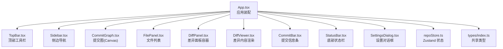

图表来源
- [App.tsx](file://src/App.tsx)
- [TopBar.tsx](file://src/components/TopBar.tsx)
- [Sidebar.tsx](file://src/components/Sidebar.tsx)
- [CommitGraph.tsx](file://src/components/CommitGraph.tsx)
- [FilePanel.tsx](file://src/components/FilePanel.tsx)
- [DiffPanel.tsx](file://src/components/DiffPanel.tsx)
- [DiffViewer.tsx](file://src/components/DiffViewer.tsx)
- [CommitBar.tsx](file://src/components/CommitBar.tsx)
- [StatusBar.tsx](file://src/components/StatusBar.tsx)
- [SettingsDialog.tsx](file://src/components/SettingsDialog.tsx)
- [repoStore.ts](file://src/stores/repoStore.ts)
- [index.ts](file://src/types/index.ts)

章节来源
- [App.tsx](file://src/App.tsx)
- [main.tsx](file://src/main.tsx)

## 核心组件
本节概述各组件的职责与协作方式，后续章节将逐一深入。

- TopBar：提供仓库选择、刷新、主题切换等全局操作入口。
- Sidebar：展示分支、标签、工作区状态等导航项，驱动视图切换，包含完整的 Git 分支管理、stash 操作和 reset 功能。
- CommitGraph：基于 Canvas 2D 渲染提交图，支持滚动、缩放、视口裁剪，**新增**日期/时间列显示、Ctrl+F 搜索功能和匹配高亮导航。
- FilePanel：列出当前提交或分支的文件树，支持选中与过滤。
- DiffPanel：承载 DiffViewer，管理差异数据与布局。
- DiffViewer：渲染文件差异内容，支持行高亮、跳转与搜索。
- CommitBar：显示选中提交的元信息与快捷操作。
- StatusBar：展示仓库状态、操作进度、错误提示等。
- SettingsDialog：打开/关闭设置面板，修改主题、语言、缓存策略等。

章节来源
- [TopBar.tsx](file://src/components/TopBar.tsx)
- [Sidebar.tsx](file://src/components/Sidebar.tsx)
- [CommitGraph.tsx](file://src/components/CommitGraph.tsx)
- [FilePanel.tsx](file://src/components/FilePanel.tsx)
- [DiffPanel.tsx](file://src/components/DiffPanel.tsx)
- [DiffViewer.tsx](file://src/components/DiffViewer.tsx)
- [CommitBar.tsx](file://src/components/CommitBar.tsx)
- [StatusBar.tsx](file://src/components/StatusBar.tsx)
- [SettingsDialog.tsx](file://src/components/SettingsDialog.tsx)

## 架构总览
组件通过 Zustand store 进行状态共享，Git 操作经由 Electron IPC 到主进程执行，渲染进程仅做 UI 呈现与事件转发。

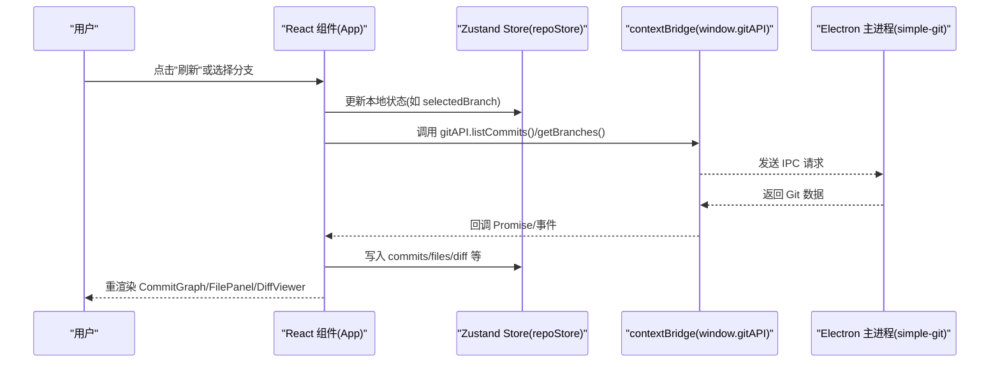

图表来源
- [repoStore.ts](file://src/stores/repoStore.ts)
- [index.ts](file://src/types/index.ts)
- [main.tsx](file://src/main.tsx)

## 详细组件分析

### TopBar（顶部工具栏）
- 职责：仓库路径选择、刷新、主题切换、国际化切换、帮助入口。
- 输入：store 中的仓库路径、主题、语言、加载状态。
- 输出：触发 store 动作（切换主题/语言、刷新仓库）、IPC 调用（获取分支/提交）。
- 交互：下拉选择仓库、按钮点击刷新、弹窗打开设置。
- 错误处理：当仓库不可用或权限不足时，StatusBar 显示错误提示。

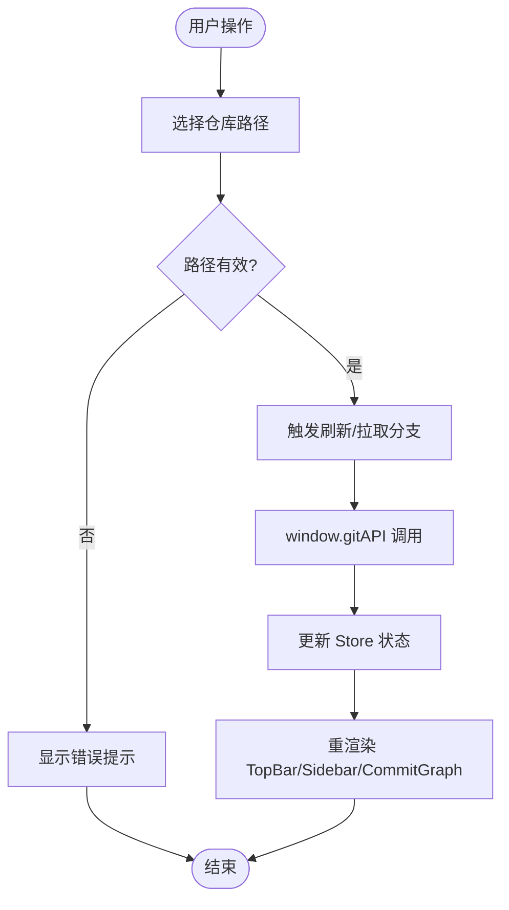

章节来源
- [TopBar.tsx](file://src/components/TopBar.tsx)
- [repoStore.ts](file://src/stores/repoStore.ts)
- [StatusBar.tsx](file://src/components/StatusBar.tsx)

### Sidebar（侧边导航）
- 职责：展示分支、标签、工作区状态；切换当前分支/提交；打开文件面板。
- 输入：分支列表、当前分支、选中提交、仓库状态。
- 输出：切换分支/提交、触发文件面板刷新。
- 交互：点击分支切换、点击提交定位、右键上下文菜单操作。
- 功能：完整的 Git 分支管理（创建、删除、切换）、stash 操作（保存、恢复、删除）、reset 功能（软重置、硬重置、混合重置）。
- 性能：大量分支时使用虚拟滚动或分页加载。

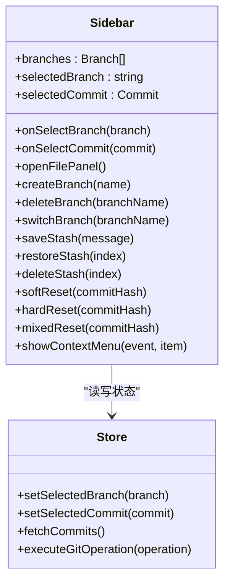

图表来源
- [Sidebar.tsx](file://src/components/Sidebar.tsx)
- [repoStore.ts](file://src/stores/repoStore.ts)

章节来源
- [Sidebar.tsx](file://src/components/Sidebar.tsx)
- [repoStore.ts](file://src/stores/repoStore.ts)

### CommitGraph（提交图）
- 职责：Canvas 2D 绘制提交图，支持滚动、缩放、节点点击、视口裁剪。
- 输入：提交列表、当前选中提交、画布尺寸、缩放级别。
- 输出：选中提交变更、滚动/缩放事件、节点 hover 提示。
- 算法要点：视口裁剪减少绘制开销；按需计算节点位置与连线；颜色映射分支。
- 性能：使用 requestAnimationFrame、离屏缓冲、增量重绘。

**更新** 新增了以下功能：
- **日期/时间列显示**：在提交图中增加日期和时间信息列，方便用户快速了解提交时间线
- **Ctrl+F 搜索功能**：支持通过 Ctrl+F 快捷键进行搜索，自动聚焦到搜索框
- **匹配高亮显示**：搜索结果会在提交图中高亮显示匹配的提交节点
- **智能滚动导航**：自动滚动到第一个匹配的提交节点，提升查找效率
- **增强的用户界面**：改进的视觉反馈和交互体验

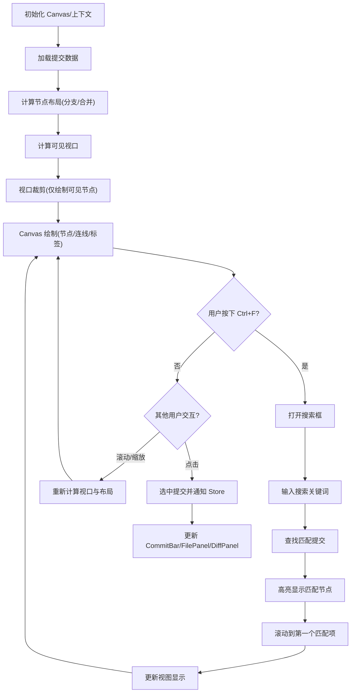

**Section sources**
- [CommitGraph.tsx](file://src/components/CommitGraph.tsx)
- [repoStore.ts](file://src/stores/repoStore.ts)

### FilePanel（文件面板）
- 职责：展示当前提交或分支的文件树，支持选中、过滤、展开/折叠。
- 输入：文件列表、当前选中文件、过滤关键词。
- 输出：选中文件变更、触发 DiffPanel 刷新。
- 交互：点击文件打开差异、输入框过滤、右键菜单（可选）。
- 性能：大文件树使用虚拟列表或懒加载。

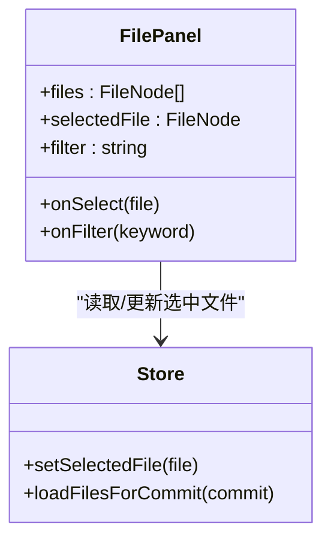

图表来源
- [FilePanel.tsx](file://src/components/FilePanel.tsx)
- [repoStore.ts](file://src/stores/repoStore.ts)

章节来源
- [FilePanel.tsx](file://src/components/FilePanel.tsx)
- [repoStore.ts](file://src/stores/repoStore.ts)

### DiffPanel（差异面板容器）
- 职责：管理差异数据的生命周期与布局，承载 DiffViewer。
- 输入：选中的两个版本/文件的差异数据、布局模式（左右/上下）。
- 输出：切换布局、复制差异文本、跳转到指定行。
- 交互：工具栏按钮切换布局、点击行号跳转。

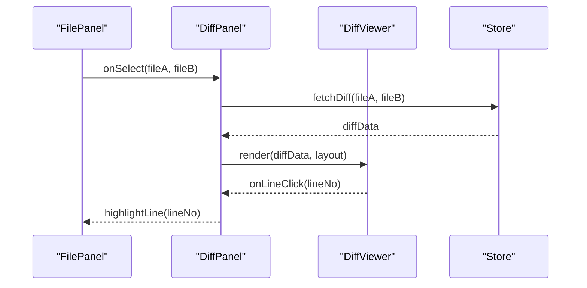

图表来源
- [DiffPanel.tsx](file://src/components/DiffPanel.tsx)
- [DiffViewer.tsx](file://src/components/DiffViewer.tsx)
- [repoStore.ts](file://src/stores/repoStore.ts)

章节来源
- [DiffPanel.tsx](file://src/components/DiffPanel.tsx)
- [DiffViewer.tsx](file://src/components/DiffViewer.tsx)
- [repoStore.ts](file://src/stores/repoStore.ts)

### DiffViewer（差异查看器）
- 职责：渲染差异内容，支持行高亮、搜索、跳转、复制。
- 输入：diff 数据、当前选中行、搜索关键字。
- 输出：行点击事件、搜索命中结果、复制成功反馈。
- 性能：长差异采用虚拟滚动与增量渲染。

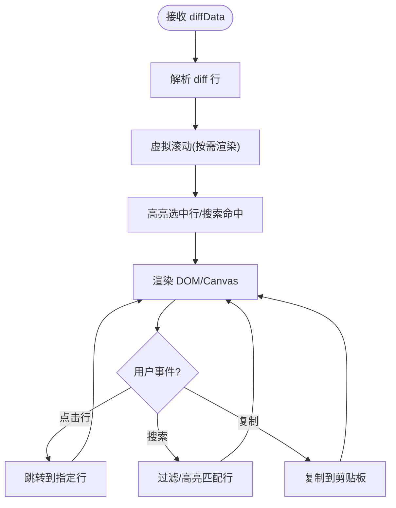

章节来源
- [DiffViewer.tsx](file://src/components/DiffViewer.tsx)
- [repoStore.ts](file://src/stores/repoStore.ts)

### CommitBar（提交信息条）
- 职责：展示选中提交的哈希、作者、时间、消息摘要与快捷操作。
- 输入：当前选中提交对象。
- 输出：复制提交哈希、打开外部浏览器查看、切换到该提交。
- 交互：点击复制、点击链接跳转。

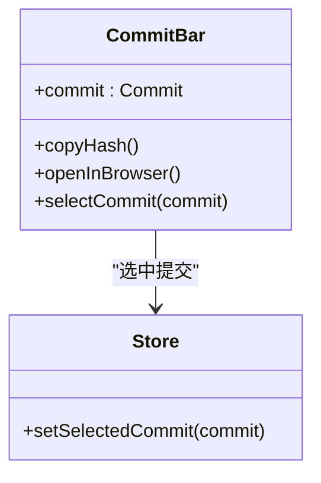

图表来源
- [CommitBar.tsx](file://src/components/CommitBar.tsx)
- [repoStore.ts](file://src/stores/repoStore.ts)

章节来源
- [CommitBar.tsx](file://src/components/CommitBar.tsx)
- [repoStore.ts](file://src/stores/repoStore.ts)

### StatusBar（状态栏）
- 职责：显示仓库状态、操作进度、错误与提示信息。
- 输入：全局 loading、error、statusMessage。
- 输出：无直接副作用，仅展示状态。
- 交互：点击错误可重试（由上层触发）。

章节来源
- [StatusBar.tsx](file://src/components/StatusBar.tsx)
- [repoStore.ts](file://src/stores/repoStore.ts)

### SettingsDialog（设置对话框）
- 职责：打开/关闭设置面板，修改主题、语言、缓存策略等。
- 输入：当前主题、语言、缓存配置。
- 输出：保存设置到持久化存储、触发主题/语言切换。
- 交互：表单输入、确认/取消、实时预览。

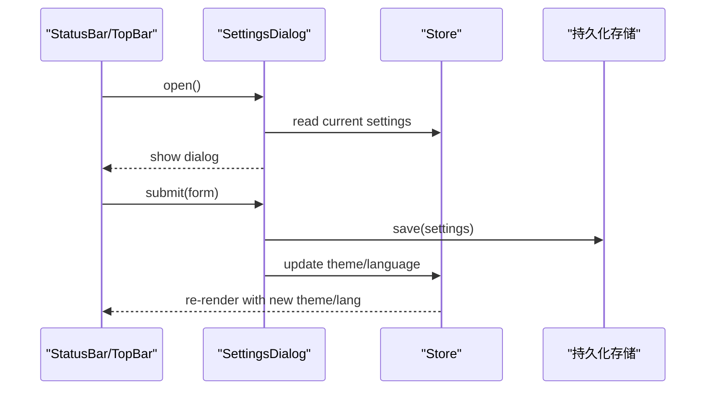

图表来源
- [SettingsDialog.tsx](file://src/components/SettingsDialog.tsx)
- [repoStore.ts](file://src/stores/repoStore.ts)

章节来源
- [SettingsDialog.tsx](file://src/components/SettingsDialog.tsx)
- [repoStore.ts](file://src/stores/repoStore.ts)

## 依赖关系分析
- 组件层：TopBar、Sidebar、CommitGraph、FilePanel、DiffPanel、DiffViewer、CommitBar、StatusBar、SettingsDialog 均依赖 repoStore 提供的状态与动作。
- 类型层：types/index.ts 定义 Commit、Branch、FileNode、Diff 等共享类型，确保组件与 store 契约一致。
- 进程间通信：渲染进程通过 window.gitAPI 调用主进程的 Git 能力，避免直接访问文件系统。

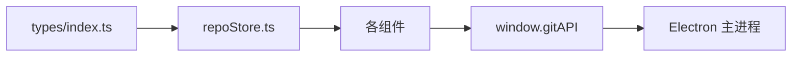

图表来源
- [index.ts](file://src/types/index.ts)
- [repoStore.ts](file://src/stores/repoStore.ts)
- [main.tsx](file://src/main.tsx)

章节来源
- [index.ts](file://src/types/index.ts)
- [repoStore.ts](file://src/stores/repoStore.ts)
- [main.tsx](file://src/main.tsx)

## 性能考量
- 提交图渲染：使用 Canvas 2D 与视口裁剪，避免全量绘制；结合 requestAnimationFrame 与离屏缓冲提升流畅度。
- 大文件树与差异：采用虚拟滚动与增量渲染，降低 DOM 压力。
- 状态管理：Zustand 细粒度订阅，避免不必要重渲染。
- IPC 批处理：批量请求与去抖/节流，减少主进程负载。
- **新增**：Git 操作优化，批量执行多个 Git 命令，减少 IPC 调用次数。
- **新增**：搜索功能优化，使用高效的字符串匹配算法，避免阻塞主线程。

[本节为通用指导，不直接分析具体文件]

## 故障排查指南
- 仓库不可用：检查路径与权限，StatusBar 会显示错误；确认 Electron 主进程已启动且 IPC 通道正常。
- 提交图不更新：确认 store 中 commits 已更新；检查 Canvas 重绘逻辑是否被正确触发。
- 差异为空：确认选择的两个版本存在差异；检查 fetchDiff 的参数与返回值。
- 主题/语言未生效：检查持久化存储是否写入成功；确认 store 已触发重渲染。
- **新增**：Git 操作失败：检查分支名称是否冲突、stash 索引是否有效、reset 目标提交是否存在。
- **新增**：搜索功能异常：确认搜索关键词不为空、检查匹配算法是否正确、验证滚动导航逻辑。

章节来源
- [StatusBar.tsx](file://src/components/StatusBar.tsx)
- [repoStore.ts](file://src/stores/repoStore.ts)
- [SettingsDialog.tsx](file://src/components/SettingsDialog.tsx)

## 结论
ZenTree 的组件体系清晰分层：UI 组件专注展示与交互，Zustand store 集中管理状态，Electron IPC 桥接 Git 能力。通过 Canvas 2D 与视口裁剪实现高性能提交图渲染，配合虚拟滚动与增量渲染保障大仓库体验。**最新的 CommitGraph 组件增强**提供了日期/时间列显示、Ctrl+F 搜索功能和智能导航，显著提升了用户的提交浏览体验。通过高效的搜索算法和直观的视觉反馈，开发者可以快速定位和分析特定的提交记录。遵循本文档的组件职责与交互约定，可快速扩展与维护。

[本节为总结性内容，不直接分析具体文件]

## 附录
- 主题与国际化：通过 CSS 自定义属性与 i18n 模块实现，可在 SettingsDialog 中实时切换。
- 打包与发布：electron-builder 支持多平台安装包与便携版。
- **新增**：Git 操作最佳实践：建议在执行破坏性操作（如硬重置）前备份重要更改，合理使用 stash 暂存临时更改。
- **新增**：搜索功能使用技巧：使用精确的提交哈希、作者名或提交消息片段进行快速定位，利用高亮显示快速识别匹配结果。

[本节为补充说明，不直接分析具体文件]