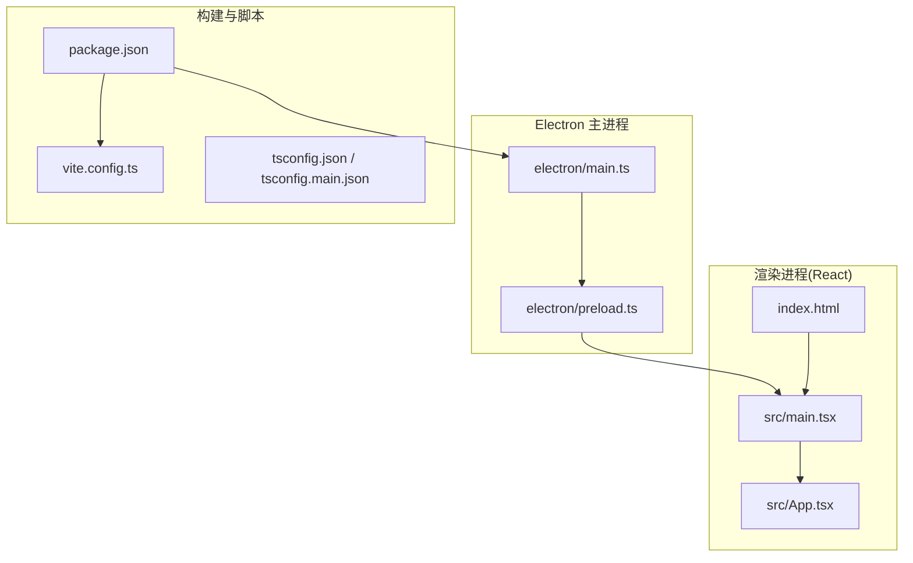
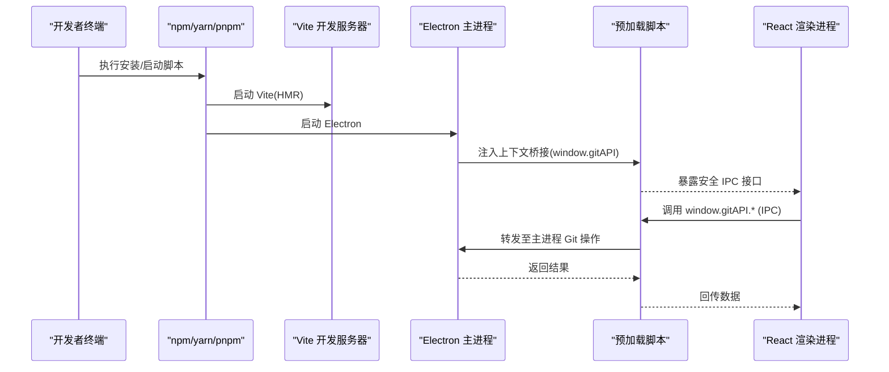
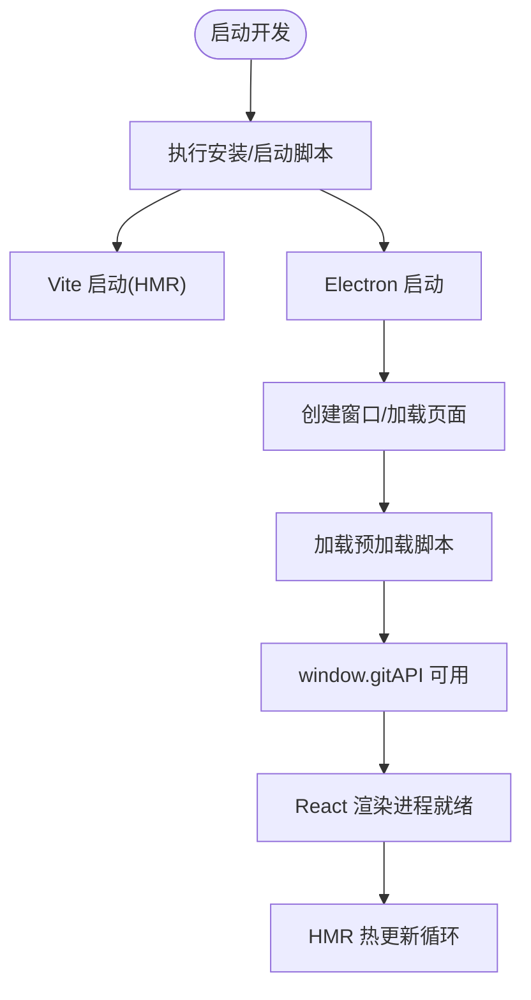
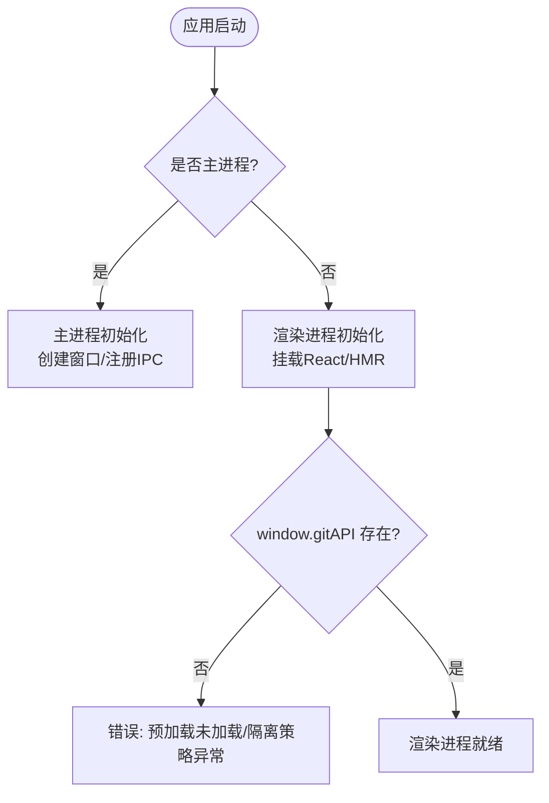
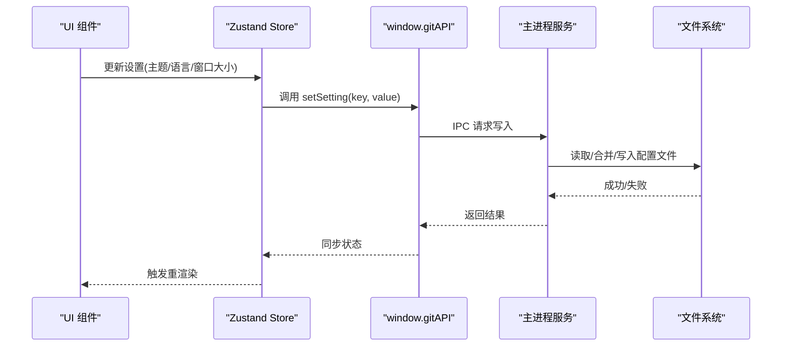
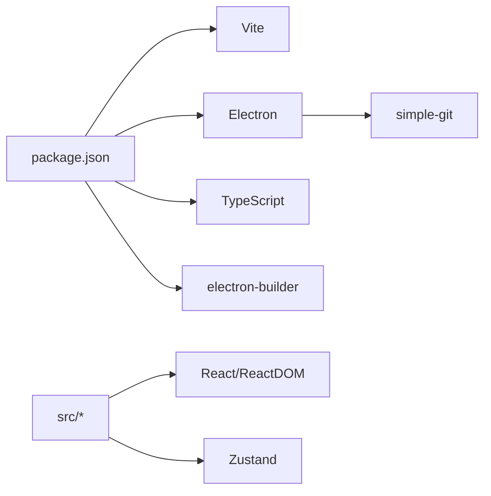

# 快速开始

<cite>
**本文引用的文件**   
- [package.json](file://package.json)
- [vite.config.ts](file://vite.config.ts)
- [tsconfig.json](file://tsconfig.json)
- [tsconfig.main.json](file://tsconfig.main.json)
- [electron/main.ts](file://electron/main.ts)
- [electron/preload.ts](file://electron/preload.ts)
- [src/main.tsx](file://src/main.tsx)
- [src/App.tsx](file://src/App.tsx)
- [index.html](file://index.html)
- [.gitignore](file://.gitignore)
</cite>

## 目录
1. [简介](#简介)
2. [项目结构](#项目结构)
3. [核心组件](#核心组件)
4. [架构总览](#架构总览)
5. [详细组件分析](#详细组件分析)
6. [依赖分析](#依赖分析)
7. [性能考虑](#性能考虑)
8. [故障排查指南](#故障排查指南)
9. [结论](#结论)
10. [附录](#附录)

## 简介
本指南面向首次接触 ZenTree 的开发者，聚焦开发环境搭建与本地运行：从前置条件、克隆与安装，到启动开发服务器（Vite HMR + Electron）、构建与打包命令，以及 TypeScript/Vite 配置要点、运行时环境检测与设置存储机制。ZenTree 是基于 Electron 36 + React 18 + TypeScript 5.7 + Zustand 5 + simple-git 3.27 的轻量级 Git GUI 客户端，渲染层通过 HTML5 Canvas 2D 绘制提交图，并支持多主题与中英双语实时切换。

## 项目结构
仓库采用“Electron 主进程 + Vite/React 渲染进程”的经典双进程架构：
- electron/：Electron 主进程与预加载脚本
- src/：React 渲染进程源码（含组件、国际化、状态管理、类型定义等）
- index.html：应用入口页面
- package.json：脚本与依赖声明
- vite.config.ts：Vite 构建与代理配置
- tsconfig*.json：TypeScript 编译配置
- .gitignore：忽略规则

图表来源
- [package.json](file://package.json)
- [vite.config.ts](file://vite.config.ts)
- [electron/main.ts](file://electron/main.ts)
- [electron/preload.ts](file://electron/preload.ts)
- [index.html](file://index.html)
- [src/main.tsx](file://src/main.tsx)
- [src/App.tsx](file://src/App.tsx)

章节来源
- [package.json](file://package.json)
- [vite.config.ts](file://vite.config.ts)
- [electron/main.ts](file://electron/main.ts)
- [electron/preload.ts](file://electron/preload.ts)
- [index.html](file://index.html)
- [src/main.tsx](file://src/main.tsx)
- [src/App.tsx](file://src/App.tsx)

## 核心组件
- 开发环境与脚本
  - 使用 Node.js LTS 与 npm/yarn/pnpm 任一包管理器
  - 安装依赖后通过脚本启动开发服务器与 Electron 应用
- 构建与打包
  - 构建产物由 Vite 生成，Electron 打包由 electron-builder 完成
- TypeScript 配置
  - 渲染进程与主进程分别使用独立的 tsconfig
- 运行时环境检测
  - 通过全局变量区分主/渲染进程，安全暴露 IPC API
- 设置存储
  - 使用 Electron 原生持久化能力保存用户偏好

章节来源
- [package.json](file://package.json)
- [vite.config.ts](file://vite.config.ts)
- [tsconfig.json](file://tsconfig.json)
- [tsconfig.main.json](file://tsconfig.main.json)
- [electron/preload.ts](file://electron/preload.ts)

## 架构总览
下图展示了从脚本到应用的完整调用链与环境边界：

图表来源
- [package.json](file://package.json)
- [vite.config.ts](file://vite.config.ts)
- [electron/main.ts](file://electron/main.ts)
- [electron/preload.ts](file://electron/preload.ts)
- [src/main.tsx](file://src/main.tsx)

## 详细组件分析

### 前置条件与安装
- 前置条件
  - Node.js LTS（推荐最新稳定版）
  - Git（用于简单 Git 操作）
  - 可选：系统级打包依赖（Windows/macOS/Linux 打包时按需安装）
- 克隆与安装
  - 克隆仓库后，在项目根目录执行依赖安装
  - 安装完成后即可进入下一步启动开发服务器

章节来源
- [package.json](file://package.json)
- [.gitignore](file://.gitignore)

### 启动开发服务器（Vite HMR + Electron）
- 启动流程
  - 通过脚本同时启动 Vite 开发服务器与 Electron 应用
  - Vite 负责热更新与资源构建；Electron 作为宿主加载渲染进程
- 关键行为
  - 主进程初始化窗口与生命周期
  - 预加载脚本启用 contextIsolation，并通过 contextBridge 暴露 window.gitAPI
  - 渲染进程通过 window.gitAPI 调用 Git 相关能力

图表来源
- [package.json](file://package.json)
- [vite.config.ts](file://vite.config.ts)
- [electron/main.ts](file://electron/main.ts)
- [electron/preload.ts](file://electron/preload.ts)
- [src/main.tsx](file://src/main.tsx)

章节来源
- [package.json](file://package.json)
- [vite.config.ts](file://vite.config.ts)
- [electron/main.ts](file://electron/main.ts)
- [electron/preload.ts](file://electron/preload.ts)
- [src/main.tsx](file://src/main.tsx)

### 构建与打包
- 构建命令
  - 使用 Vite 构建生产资源
- 打包命令
  - 使用 electron-builder 为当前平台或指定平台打包安装包/便携版
- 输出产物
  - 可执行文件、安装包（NSIS/DMG/AppImage/deb 等）与资源目录

章节来源
- [package.json](file://package.json)

### TypeScript/Vite 配置要点
- TypeScript
  - 渲染进程与主进程分别使用独立 tsconfig，确保模块解析与目标一致
  - 严格模式与路径别名建议开启以提升开发体验
- Vite
  - 开发服务器端口、代理、插件与构建优化可按需调整
  - 静态资源与 CSS 主题通过 Vite 管线处理

章节来源
- [tsconfig.json](file://tsconfig.json)
- [tsconfig.main.json](file://tsconfig.main.json)
- [vite.config.ts](file://vite.config.ts)

### 运行时环境检测
- 进程识别
  - 通过全局变量判断当前是否在主进程或渲染进程
- 安全边界
  - 渲染进程禁用 nodeIntegration，启用 contextIsolation
  - 仅通过预加载脚本暴露最小必要 API（window.gitAPI）

图表来源
- [electron/main.ts](file://electron/main.ts)
- [electron/preload.ts](file://electron/preload.ts)
- [src/main.tsx](file://src/main.tsx)

章节来源
- [electron/main.ts](file://electron/main.ts)
- [electron/preload.ts](file://electron/preload.ts)
- [src/main.tsx](file://src/main.tsx)

### 设置存储
- 存储位置
  - 使用 Electron 提供的持久化能力（如 app.getPath('userData')）
- 读写策略
  - 主进程统一读写，渲染进程通过 IPC 调用
- 数据结构
  - 以 JSON 文件形式保存主题、语言、窗口尺寸等偏好

图表来源
- [electron/main.ts](file://electron/main.ts)
- [electron/preload.ts](file://electron/preload.ts)
- [src/main.tsx](file://src/main.tsx)

章节来源
- [electron/main.ts](file://electron/main.ts)
- [electron/preload.ts](file://electron/preload.ts)
- [src/main.tsx](file://src/main.tsx)

## 依赖分析
- 运行时依赖
  - Electron 提供桌面容器与 IPC
  - React/ReactDOM 负责 UI 渲染
  - simple-git 在 Electron 主进程执行 Git 命令
  - Zustand 管理前端状态
- 构建依赖
  - Vite 提供开发与构建能力
  - TypeScript 提供类型检查与编译
  - electron-builder 负责打包分发

图表来源
- [package.json](file://package.json)

章节来源
- [package.json](file://package.json)

## 性能考虑
- 渲染性能
  - 提交图使用 Canvas 2D 绘制，结合视口裁剪可支撑万级提交
- 构建性能
  - Vite 按需编译与 HMR 提升开发效率
- 内存与 I/O
  - 大仓库建议限制初始加载提交数，按需懒加载
  - 设置文件读写集中在主进程，避免频繁 IPC 往返

[本节为通用指导，不直接分析具体文件]

## 故障排查指南
- 无法启动 Electron
  - 确认已安装依赖且 Node.js 版本兼容
  - 检查主进程初始化与窗口加载逻辑
- HMR 不生效
  - 确认 Vite 开发服务器正常监听端口
  - 检查浏览器控制台是否有跨域或模块加载错误
- IPC 调用失败
  - 确认预加载脚本已正确加载且 contextIsolation 开启
  - 检查 window.gitAPI 是否存在与方法签名
- 设置无法保存
  - 确认 userData 目录有写入权限
  - 检查配置文件格式与字段名一致性

章节来源
- [electron/main.ts](file://electron/main.ts)
- [electron/preload.ts](file://electron/preload.ts)
- [src/main.tsx](file://src/main.tsx)

## 结论
通过以上步骤，你可以在本地快速搭建 ZenTree 的开发环境，理解其基于 Electron + Vite + React 的双进程架构，掌握开发、构建与打包流程，并了解运行时环境检测与设置存储的实现方式。遇到问题时，可参考故障排查指南逐步定位。

[本节为总结性内容，不直接分析具体文件]

## 附录
- 常用命令速查
  - 安装依赖：执行包管理器安装命令
  - 启动开发：同时启动 Vite 与 Electron
  - 构建生产：生成静态资源
  - 打包应用：生成各平台安装包
- 配置文件说明
  - package.json：脚本与依赖
  - vite.config.ts：Vite 构建与代理
  - tsconfig*.json：TypeScript 编译选项

章节来源
- [package.json](file://package.json)
- [vite.config.ts](file://vite.config.ts)
- [tsconfig.json](file://tsconfig.json)
- [tsconfig.main.json](file://tsconfig.main.json)