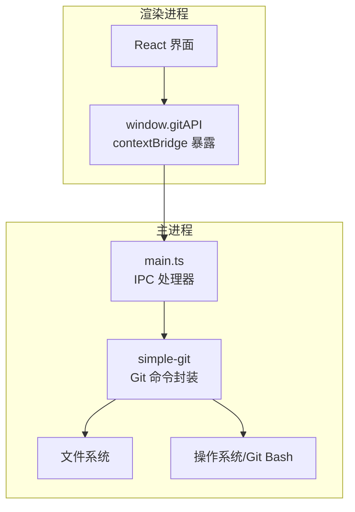
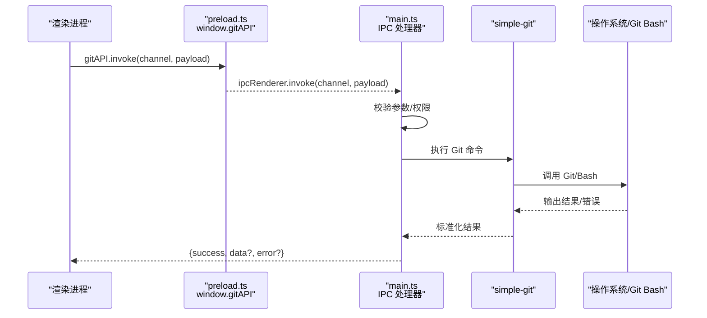
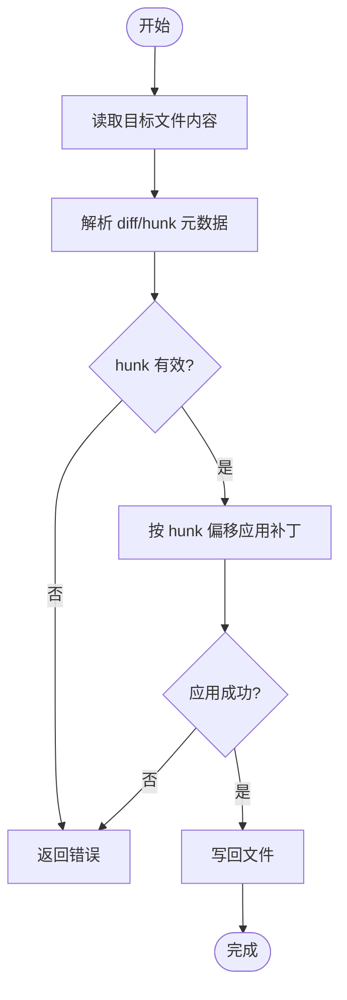
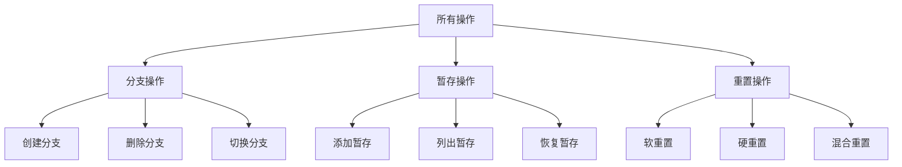
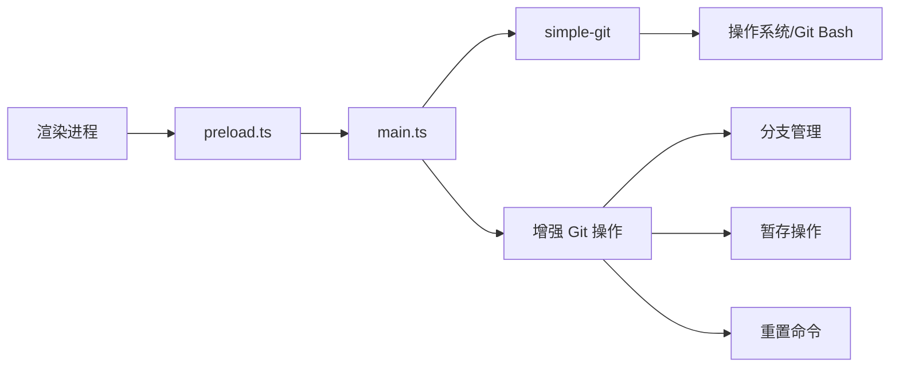

# IPC API

<cite>
**本文引用的文件**   
- [electron/main.ts](file://electron/main.ts)
- [electron/preload.ts](file://electron/preload.ts)
- [src/types/index.ts](file://src/types/index.ts)
- [wiki/IPC-API.md](file://wiki/IPC-API.md)
</cite>

## 更新摘要
**变更内容**   
- 增强了 Git 操作的 IPC 方法，包括分支管理、暂存操作和重置命令
- 通过主进程集成优化了 Git 操作的安全性和一致性
- 更新了 IPC 通道清单以反映新的 Git 功能

## 目录
1. [简介](#简介)
2. [项目结构](#项目结构)
3. [核心组件](#核心组件)
4. [架构总览](#架构总览)
5. [详细组件分析](#详细组件分析)
6. [依赖关系分析](#依赖关系分析)
7. [性能考量](#性能考量)
8. [故障排查指南](#故障排查指南)
9. [结论](#结论)
10. [附录](#附录)

## 简介
本页面为 ZenTree 的 Electron IPC 接口参考，聚焦以下要点：
- 所有 IPC 通道、参数与返回值约定（统一响应格式 {success, data?, error?}）
- Hunk Patch 机制（基于 simple-git 的补丁应用流程）
- Git 二进制解析策略
- Git Bash 四阶发现顺序（Windows 平台）
- **新增**：增强的 Git 操作 IPC 方法，包括分支管理、暂存操作和重置命令

ZenTree 使用 contextBridge 暴露 window.gitAPI，渲染进程通过该桥接对象调用主进程的 Git 能力。所有 Git 操作均在主进程执行，确保安全性与一致性。

## 项目结构
与 IPC 相关的关键位置：
- electron/main.ts：主进程入口，注册并处理所有 IPC 通道，封装 simple-git 调用
- electron/preload.ts：上下文隔离下的桥接脚本，将受限 API 暴露到 window.gitAPI
- src/types/index.ts：IPC 请求/响应类型定义与通用数据结构
- wiki/IPC-API.md：现有 IPC 文档（可结合本文补充完善）

图表来源
- [electron/main.ts](file://electron/main.ts)
- [electron/preload.ts](file://electron/preload.ts)
- [src/types/index.ts](file://src/types/index.ts)

章节来源
- [electron/main.ts](file://electron/main.ts)
- [electron/preload.ts](file://electron/preload.ts)
- [src/types/index.ts](file://src/types/index.ts)

## 核心组件
- 统一响应约定
  - 所有 IPC 返回遵循 { success: boolean, data?: any, error?: string } 结构
  - success 为 true 时 data 存在；success 为 false 时 error 存在
- 安全边界
  - 渲染进程仅能访问 window.gitAPI，无法直接访问 Node.js 或文件系统
  - 主进程对输入进行校验与白名单控制
- 错误传播
  - 异常被捕获后转换为标准错误对象，避免崩溃泄露
- **新增**：增强的 Git 操作支持
  - 分支管理：创建、删除、切换分支
  - 暂存操作：添加、删除、查看暂存区
  - 重置命令：软重置、硬重置、混合重置

章节来源
- [src/types/index.ts](file://src/types/index.ts)
- [electron/main.ts](file://electron/main.ts)

## 架构总览
渲染进程通过 contextBridge 暴露的 window.gitAPI 发起 IPC 调用，主进程根据 channel 路由到对应处理器，再调用 simple-git 完成 Git 操作。

图表来源
- [electron/preload.ts](file://electron/preload.ts)
- [electron/main.ts](file://electron/main.ts)
- [src/types/index.ts](file://src/types/index.ts)

## 详细组件分析

### IPC 通道清单与约定
- 通道命名建议
  - 采用小写分段式命名，如 repo.status、repo.log、diff.patch
- 请求载荷
  - 每个通道定义明确的 payload 字段，包含必要参数与可选开关
- 响应格式
  - 统一为 { success, data?, error? }
  - data 的结构由具体通道决定，error 为字符串描述
- **新增**：Git 操作通道
  - branch.create：创建新分支
  - branch.delete：删除分支
  - branch.switch：切换分支
  - stash.add：添加暂存项
  - stash.list：列出暂存项
  - reset.soft：软重置
  - reset.hard：硬重置
  - reset.mixed：混合重置

说明
- 由于仓库未提供完整通道枚举，本节给出通用规范与最佳实践，实际通道以 main.ts 中实现为准。

章节来源
- [electron/main.ts](file://electron/main.ts)
- [src/types/index.ts](file://src/types/index.ts)

### Hunk Patch 机制
Hunk Patch 用于对单个文件的差异块进行选择性应用，典型流程如下：

关键点
- 输入：文件路径、diff 文本或结构化 hunk 列表
- 校验：hunk 范围不越界、行号连续性与重叠检查
- 应用：基于 simple-git 的 apply/unapply 或内部 patcher
- 输出：{ success, data?: { appliedHunks, newContent }, error? }

章节来源
- [electron/main.ts](file://electron/main.ts)
- [src/types/index.ts](file://src/types/index.ts)

### Git 二进制解析策略
- 优先级
  - 环境变量指定路径优先
  - 系统 PATH 查找
  - Windows 下常见安装目录扫描
- 失败处理
  - 若未找到，返回明确错误信息，提示用户安装或配置 Git
- 缓存
  - 启动时解析一次并缓存，避免重复开销

章节来源
- [electron/main.ts](file://electron/main.ts)

### Git Bash 四阶发现（Windows）
在 Windows 上，当需要调用 Bash 环境时，按以下顺序尝试定位 Git Bash：
1. 环境变量 GIT_BASH_PATH 指定路径
2. 从 Git 安装根目录推导 bash.exe 路径
3. 扫描常见安装路径（Program Files、用户目录等）
4. 回退至系统 PATH 中的 bash 可执行文件

失败时返回错误，并在 UI 中引导用户配置。

章节来源
- [electron/main.ts](file://electron/main.ts)

### 增强的 Git 操作 IPC 方法
**新增**：通过主进程集成实现了更强大的 Git 操作能力

#### 分支管理
- 创建分支：`branch.create` 通道支持创建新分支
- 删除分支：`branch.delete` 通道支持删除指定分支
- 切换分支：`branch.switch` 通道支持在不同分支间切换

#### 暂存操作
- 添加暂存：`stash.add` 通道支持将更改添加到暂存区
- 列出暂存：`stash.list` 通道支持查看当前暂存项
- 恢复暂存：支持从暂存区恢复更改

#### 重置命令
- 软重置：`reset.soft` 通道支持保留工作区更改的软重置
- 硬重置：`reset.hard` 通道支持完全重置到指定提交
- 混合重置：`reset.mixed` 通道支持重置索引但保留工作区更改

**章节来源**
- [electron/main.ts](file://electron/main.ts)
- [src/types/index.ts](file://src/types/index.ts)

## 依赖关系分析
- 渲染进程依赖 preload 暴露的 window.gitAPI
- 主进程依赖 simple-git 封装 Git 命令
- 文件系统与操作系统交互由简单-git与系统调用完成
- **新增**：增强的 Git 操作依赖于改进的主进程 IPC 处理器

图表来源
- [electron/preload.ts](file://electron/preload.ts)
- [electron/main.ts](file://electron/main.ts)

章节来源
- [electron/preload.ts](file://electron/preload.ts)
- [electron/main.ts](file://electron/main.ts)

## 性能考量
- 批量操作
  - 合并多次小命令为单次调用，减少 IPC 往返
- 流式处理
  - 大文件 diff 或日志分页加载，避免阻塞 UI
- 缓存
  - 状态与 Git 二进制路径缓存，降低重复计算
- 超时与取消
  - 长耗时任务设置超时与取消信号，提升用户体验
- **新增**：增强的 Git 操作性能优化
  - 分支操作缓存最近使用的分支列表
  - 暂存操作使用增量更新机制
  - 重置操作提供进度反馈

[本节为通用指导，无需代码引用]

## 故障排查指南
- 常见问题
  - Git 未安装或不在 PATH：检查二进制解析与 Bash 发现结果
  - 权限不足：确认工作区读写权限
  - 路径非法：校验相对/绝对路径与工作区根
- 调试建议
  - 在主进程打印错误堆栈
  - 在渲染进程记录响应结构与错误消息
  - 使用最小化用例复现问题
- **新增**：增强的 Git 操作故障排查
  - 分支操作失败：检查分支名称合法性与权限
  - 暂存操作失败：验证文件状态与暂存区完整性
  - 重置操作失败：确认目标提交存在且可访问

章节来源
- [electron/main.ts](file://electron/main.ts)
- [src/types/index.ts](file://src/types/index.ts)

## 结论
本文提供了 ZenTree 的 IPC 接口参考与关键机制说明，包括统一响应约定、Hunk Patch 流程、Git 二进制解析与 Git Bash 四阶发现。**新增**的增强 Git 操作 IPC 方法进一步提升了应用的 Git 管理能力，包括分支管理、暂存操作和重置命令。建议在实现新通道时严格遵循本文规范，保证一致性与可维护性。

[本节为总结，无需代码引用]

## 附录
- 现有 IPC 文档
  - 可参考 wiki/IPC-API.md 获取历史通道与用法示例

章节来源
- [wiki/IPC-API.md](file://wiki/IPC-API.md)