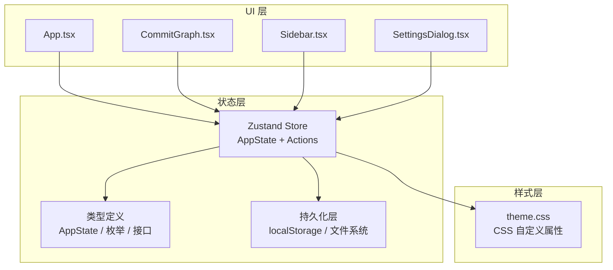
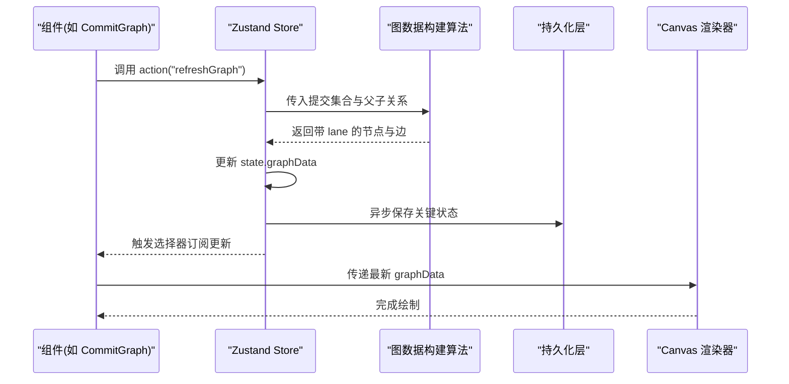
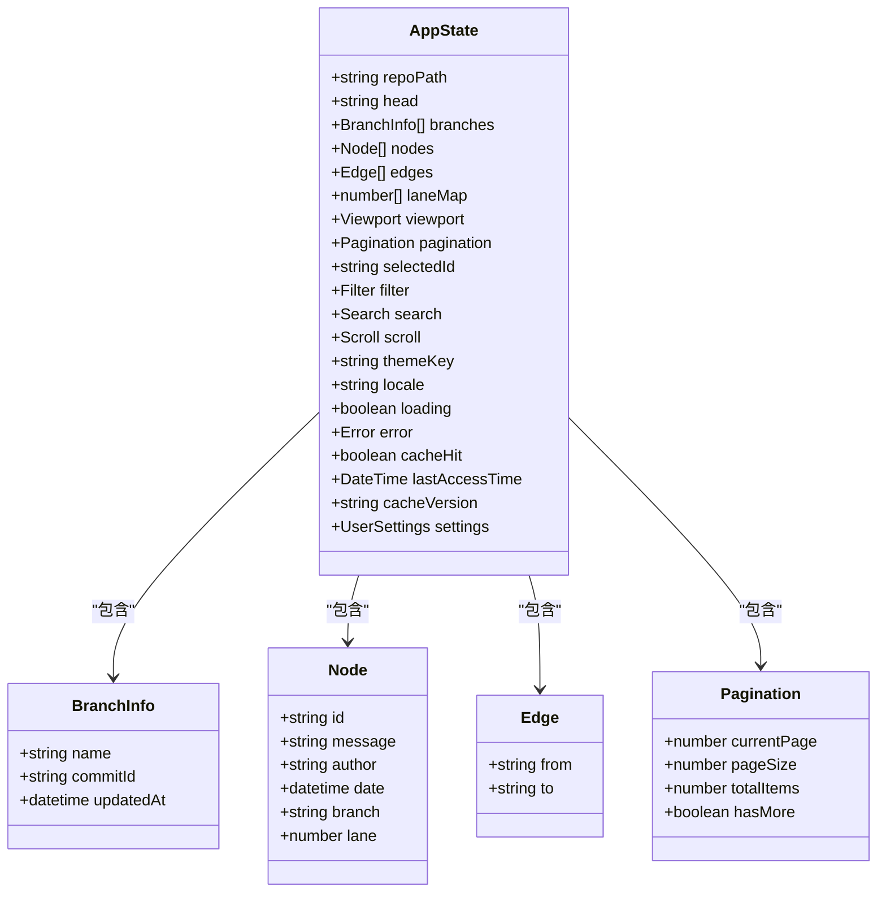
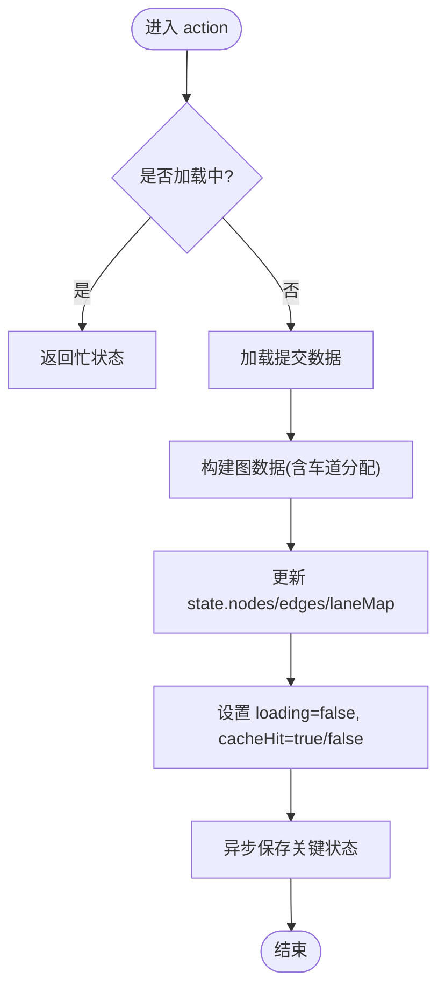
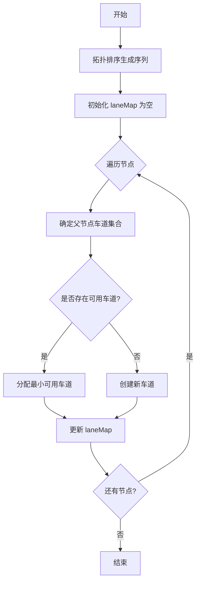
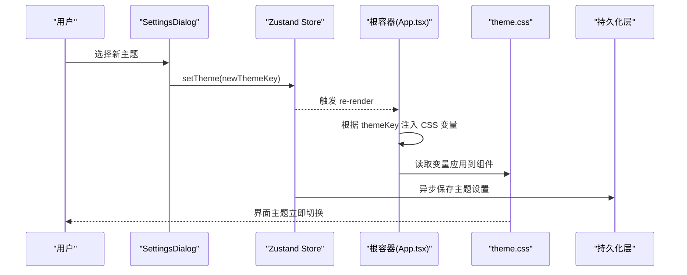
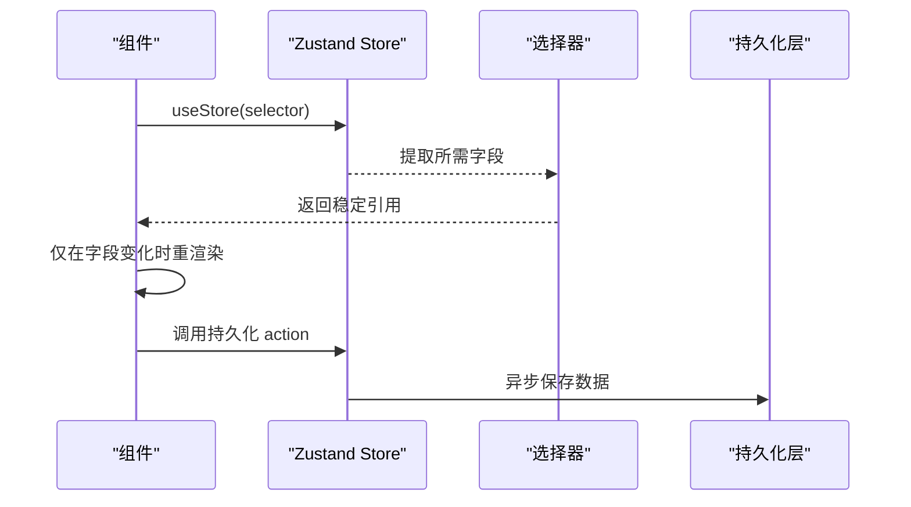
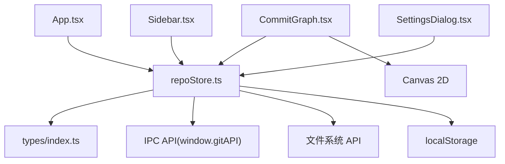

# 状态管理

<cite>
**本文引用的文件**   
- [repoStore.ts](file://src/stores/repoStore.ts)
- [index.ts](file://src/types/index.ts)
- [App.tsx](file://src/App.tsx)
- [CommitGraph.tsx](file://src/components/CommitGraph.tsx)
- [Sidebar.tsx](file://src/components/Sidebar.tsx)
- [SettingsDialog.tsx](file://src/components/SettingsDialog.tsx)
- [theme.css](file://src/theme.css)
- [main.tsx](file://src/main.tsx)
</cite>

## 更新摘要
**所做更改**   
- 新增仓库持久化功能，支持设置存储与恢复
- 增强 repoStore 的分页处理机制
- 更新状态管理架构以支持数据持久化
- 优化仓库数据的本地缓存策略

## 目录
1. [简介](#简介)
2. [项目结构](#项目结构)
3. [核心组件](#核心组件)
4. [架构总览](#架构总览)
5. [详细组件分析](#详细组件分析)
6. [依赖分析](#依赖分析)
7. [性能考虑](#性能考虑)
8. [故障排查指南](#故障排查指南)
9. [结论](#结论)
10. [附录](#附录)

## 简介
本文件聚焦于 ZenTree 的状态管理设计，围绕 Zustand store 的 AppState 全量形状、关键动作（actions）、提交图数据构建算法（车道分配）、主题应用机制以及使用模式（选择器订阅与命令式访问）进行系统化说明。目标是帮助开发者快速理解状态模型、数据流与渲染联动方式，并在扩展功能时保持高内聚、低耦合与可维护性。

**更新** 新增了仓库持久化功能和增强的分页处理机制，提升了用户体验和数据加载效率。

## 项目结构
- 状态定义与持久化：位于 src/stores/repoStore.ts，集中管理仓库级状态、UI 状态与主题设置，并支持本地持久化存储。
- 类型定义：位于 src/types/index.ts，统一描述 AppState 字段、枚举与接口契约。
- UI 层消费：各组件通过 useStore(selector) 订阅所需切片，避免不必要重渲染。
- 主题系统：基于 CSS 自定义属性，由 store 中的主题键驱动样式切换。
- 持久化层：集成 localStorage 或文件系统 API，实现设置和仓库数据的自动保存与恢复。

**图表来源** 
- [repoStore.ts](file://src/stores/repoStore.ts)
- [index.ts](file://src/types/index.ts)
- [App.tsx](file://src/App.tsx)
- [CommitGraph.tsx](file://src/components/CommitGraph.tsx)
- [Sidebar.tsx](file://src/components/Sidebar.tsx)
- [SettingsDialog.tsx](file://src/components/SettingsDialog.tsx)
- [theme.css](file://src/theme.css)

**章节来源**
- [repoStore.ts](file://src/stores/repoStore.ts)
- [index.ts](file://src/types/index.ts)

## 核心组件
- AppState 全量形状
  - 仓库元信息与分支信息
  - 提交图数据（节点、边、车道分配结果）
  - 视图状态（滚动位置、选中项、筛选条件、分页信息）
  - 主题配置（当前主题键、语言等）
  - 操作标志位（加载、错误、缓存命中等）
  - 持久化状态（上次访问时间、缓存版本等）
- 关键动作（Actions）
  - 初始化与刷新：加载仓库、拉取提交、重建图数据
  - 视图交互：选择提交、展开/折叠、滚动定位、分页导航
  - 主题与国际化：切换主题、切换语言
  - 持久化操作：保存设置、恢复状态、清理缓存
  - 辅助工具：清空缓存、导出日志
- 图数据构建算法（车道分配）
  - 输入：提交集合与父子关系
  - 过程：拓扑排序 + 贪心车道分配（冲突检测与回退）
  - 输出：带 lane 属性的节点列表与边集合
- 主题应用机制
  - store 持有 themeKey
  - 根容器根据 themeKey 注入 CSS 变量
  - 组件通过 CSS 变量读取颜色与字体等
- 持久化机制
  - 自动保存：用户设置和关键状态自动同步到本地存储
  - 智能恢复：应用启动时恢复上次会话状态
  - 版本兼容：支持不同版本的设置格式迁移

**章节来源**
- [repoStore.ts](file://src/stores/repoStore.ts)
- [index.ts](file://src/types/index.ts)

## 架构总览
Zustand store 作为单一事实源，被多个 React 组件以选择器订阅；图数据构建在 store action 中触发，完成后更新 state，触发 Canvas 渲染；主题切换通过修改 store 中的 themeKey，进而改变 CSS 变量生效；持久化层确保用户设置的跨会话一致性。

**图表来源** 
- [repoStore.ts](file://src/stores/repoStore.ts)
- [CommitGraph.tsx](file://src/components/CommitGraph.tsx)

## 详细组件分析

### AppState 形状与类型契约
- 字段分组
  - 仓库相关：路径、分支、HEAD、统计信息
  - 图数据：nodes[]、edges[]、laneMap、viewport
  - UI 状态：selectedId、filter、search、scroll、pagination
  - 主题与语言：themeKey、locale
  - 控制标志：loading、error、cacheHit
  - 持久化：lastAccessTime、cacheVersion、settings
- 类型约束
  - 使用 TypeScript 接口与联合类型确保数据结构一致性
  - 对可选字段提供默认值或空结构，保证渲染稳定性
  - 新增分页相关字段支持大仓库的高效浏览

**图表来源** 
- [index.ts](file://src/types/index.ts)

**章节来源**
- [index.ts](file://src/types/index.ts)

### 关键动作（Actions）设计
- 刷新与构建
  - refreshGraph：触发 simple-git 获取提交历史，调用图数据构建算法，写入 state
  - rebuildLaneAssignment：仅重新计算车道分配，适用于筛选变化
  - loadPage：加载指定页码的提交数据，支持无限滚动
- 视图交互
  - selectCommit：更新 selectedId，触发详情面板
  - setFilter/setSearch：更新过滤与搜索条件，触发重建或增量更新
  - scrollTo：滚动到指定提交 ID
  - nextPage/prevPage：分页导航，智能加载下一页或上一页数据
- 主题与国际化
  - setTheme：更新 themeKey，并同步到根容器 CSS 变量
  - setLocale：更新 locale，触发 i18n 文本切换
- 持久化操作
  - saveSettings：保存用户设置为 JSON 字符串到本地存储
  - restoreSettings：从本地存储恢复设置，处理版本兼容性
  - clearCache：清除本地缓存，强制下次刷新
  - setError：设置错误信息并标记 loading=false

**图表来源** 
- [repoStore.ts](file://src/stores/repoStore.ts)

**章节来源**
- [repoStore.ts](file://src/stores/repoStore.ts)

### 图数据构建算法（车道分配）
- 输入：提交节点集合与父子边集合
- 步骤
  - 拓扑排序：按提交时间或哈希顺序生成线性序列
  - 车道分配：遍历节点，优先复用父节点所在车道；若冲突则尝试相邻车道
  - 冲突处理：当所有候选车道均冲突时，创建新车道并记录 laneMap
  - 边界检查：确保边连接不跨越过多车道，必要时调整布局参数
- 输出：每个节点附带 lane 编号，便于 Canvas 横向排列与连线绘制
- 分页优化：支持增量构建，仅处理当前页相关的提交节点

**图表来源** 
- [repoStore.ts](file://src/stores/repoStore.ts)

**章节来源**
- [repoStore.ts](file://src/stores/repoStore.ts)

### 主题应用机制
- 存储层：store.state.themeKey 保存当前主题键
- 应用层：根容器根据 themeKey 动态设置 CSS 变量（如 --color-primary、--bg-canvas 等）
- 组件层：组件通过 CSS 变量引用颜色与样式，无需 JS 计算
- 切换流程：setTheme(themeKey) -> 更新根容器 style -> 浏览器即时生效
- 持久化：主题设置自动保存到本地存储，下次启动自动恢复

**图表来源** 
- [repoStore.ts](file://src/stores/repoStore.ts)
- [App.tsx](file://src/App.tsx)
- [theme.css](file://src/theme.css)
- [SettingsDialog.tsx](file://src/components/SettingsDialog.tsx)

**章节来源**
- [repoStore.ts](file://src/stores/repoStore.ts)
- [App.tsx](file://src/App.tsx)
- [theme.css](file://src/theme.css)
- [SettingsDialog.tsx](file://src/components/SettingsDialog.tsx)

### 使用模式（选择器订阅与命令式访问）
- 选择器订阅
  - 组件通过 useStore((state) => state.selectedId) 精确订阅，减少重渲染
  - 复杂选择器可组合多个字段，或使用 memoized selector
  - 分页相关选择器支持高效的数据切片
- 命令式访问
  - 通过 store.getState() 获取当前快照，用于非渲染逻辑（如导出、日志）
  - 通过 store.setState() 直接更新状态，适用于批量更新或外部事件回调
  - 持久化操作通过异步 action 处理，避免阻塞主线程
- 最佳实践
  - 优先使用选择器订阅，避免全局重渲染
  - 将昂贵计算放入 action 内部，返回稳定对象引用
  - 对大数组（nodes/edges）使用不可变更新策略，提升 diff 效率
  - 合理使用分页，避免一次性加载大量数据

**图表来源** 
- [repoStore.ts](file://src/stores/repoStore.ts)
- [CommitGraph.tsx](file://src/components/CommitGraph.tsx)
- [Sidebar.tsx](file://src/components/Sidebar.tsx)

**章节来源**
- [repoStore.ts](file://src/stores/repoStore.ts)
- [CommitGraph.tsx](file://src/components/CommitGraph.tsx)
- [Sidebar.tsx](file://src/components/Sidebar.tsx)

### 持久化机制
- 存储策略
  - 用户设置：JSON 格式存储在 localStorage 或 Electron 文件系统
  - 仓库缓存：结构化存储最近访问的提交数据和视图状态
  - 版本管理：支持设置格式的向后兼容和自动迁移
- 生命周期管理
  - 应用启动：自动恢复上次会话的设置和状态
  - 实时更新：关键状态变更时异步保存到本地存储
  - 内存优化：定期清理过期缓存，防止内存泄漏
- 错误处理
  - 存储失败：降级到内存存储，不影响核心功能
  - 数据损坏：自动检测并重置为默认设置
  - 权限问题：优雅处理文件访问权限异常

**章节来源**
- [repoStore.ts](file://src/stores/repoStore.ts)

## 依赖分析
- 模块耦合
  - App.tsx 依赖 store 初始化与主题设置
  - CommitGraph.tsx 依赖 store 的图数据与视图状态
  - Sidebar.tsx 依赖分支与提交选择状态
  - SettingsDialog.tsx 依赖主题与语言设置
  - 持久化层依赖 Electron API 或浏览器 localStorage
- 外部依赖
  - simple-git：通过 Electron main 进程 IPC 暴露给 renderer
  - Canvas 2D：直接绘制图数据，无第三方图表库
  - 文件系统 API：用于 Electron 环境下的持久化存储
- 潜在循环依赖
  - 组件不应直接导入其他组件，应通过 store 解耦
  - 持久化逻辑封装在 store 内部，避免外部直接依赖

**图表来源** 
- [App.tsx](file://src/App.tsx)
- [repoStore.ts](file://src/stores/repoStore.ts)
- [CommitGraph.tsx](file://src/components/CommitGraph.tsx)
- [Sidebar.tsx](file://src/components/Sidebar.tsx)
- [SettingsDialog.tsx](file://src/components/SettingsDialog.tsx)
- [index.ts](file://src/types/index.ts)

**章节来源**
- [App.tsx](file://src/App.tsx)
- [repoStore.ts](file://src/stores/repoStore.ts)
- [CommitGraph.tsx](file://src/components/CommitGraph.tsx)
- [Sidebar.tsx](file://src/components/Sidebar.tsx)
- [SettingsDialog.tsx](file://src/components/SettingsDialog.tsx)
- [index.ts](file://src/types/index.ts)

## 性能考虑
- 选择器粒度：细粒度订阅避免无关重渲染
- 数据不可变性：nodes/edges 更新采用浅拷贝或结构化共享，降低 diff 成本
- 视口裁剪：Canvas 渲染仅绘制可见区域，支持 10,000+ 提交流畅展示
- 缓存策略：首次加载后缓存图数据，筛选/搜索时增量重建
- 异步优化：长任务分片执行，避免阻塞主线程
- 分页优化：按需加载提交数据，减少初始加载时间
- 持久化优化：批量保存和延迟写入，避免频繁 I/O 操作

## 故障排查指南
- 常见问题
  - 主题未生效：检查 themeKey 是否正确注入根容器 CSS 变量
  - 图数据异常：确认拓扑排序与车道分配逻辑是否处理了环与孤立节点
  - 选择器不更新：验证 selector 引用是否稳定，避免每次创建新函数
  - 持久化失败：检查存储空间权限和磁盘容量
  - 分页异常：确认分页参数计算和边界条件处理
- 调试技巧
  - 使用 store.subscribe 监听状态变化，打印关键字段
  - 在 action 中加入日志，追踪数据构建耗时
  - 通过 DevTools 检查 Redux-like 状态快照（Zustand middleware）
  - 监控 localStorage 或文件系统的使用情况
  - 使用性能分析工具识别瓶颈

**章节来源**
- [repoStore.ts](file://src/stores/repoStore.ts)
- [App.tsx](file://src/App.tsx)

## 结论
ZenTree 的 Zustand 状态管理以清晰的 AppState 形状、高效的图数据构建算法与灵活的订阅模式为核心，结合 CSS 自定义属性的主题机制和本地持久化能力，实现了高性能、可扩展且易维护的 Git GUI 客户端。新增的仓库持久化功能和增强的分页处理机制进一步提升了用户体验，使应用能够高效处理大型仓库并提供无缝的浏览体验。遵循本文的设计原则与实践建议，可在现有基础上平滑扩展新功能并保持代码质量。

## 附录
- 术语表
  - 车道（Lane）：提交在水平方向上的分配槽位，用于避免连线交叉
  - 视口裁剪（Viewport Culling）：仅渲染可见区域的提交节点与边
  - 选择器（Selector）：从 state 中提取子集的函数，用于精确订阅
  - 持久化（Persistence）：将应用状态保存到本地存储以实现跨会话一致性
  - 分页（Pagination）：将大数据集分割成较小块以提高加载和渲染性能
- 参考文件
  - 状态定义：src/types/index.ts
  - 状态实现：src/stores/repoStore.ts
  - 主题样式：src/theme.css
  - 入口应用：src/App.tsx
  - 图渲染：src/components/CommitGraph.tsx
  - 设置对话框：src/components/SettingsDialog.tsx