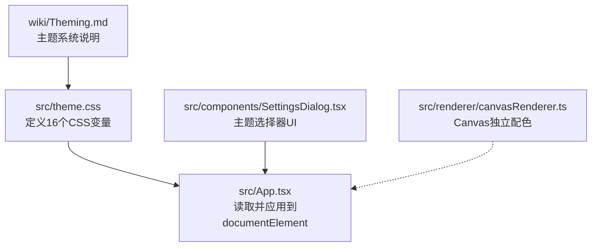
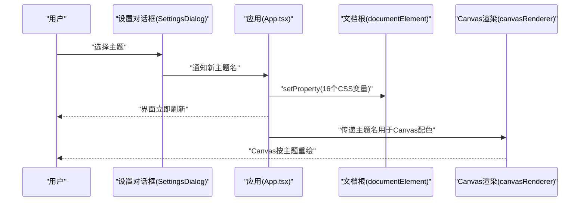
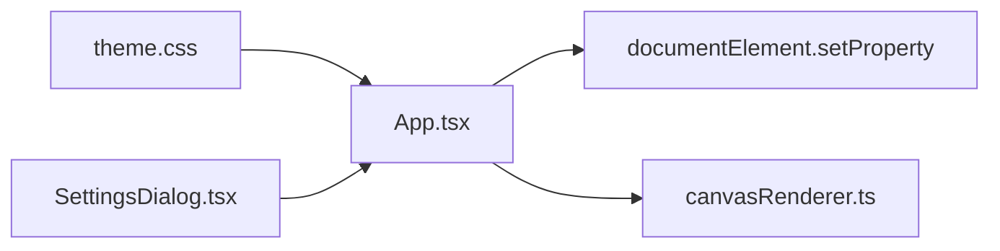

# 主题系统（Theming）

<cite>
**本文引用的文件**   
- [theme.css](file://src/theme.css)
- [App.tsx](file://src/App.tsx)
- [SettingsDialog.tsx](file://src/components/SettingsDialog.tsx)
- [canvasRenderer.ts](file://src/renderer/canvasRenderer.ts)
- [Theming.md](file://wiki/Theming.md)
</cite>

## 目录
1. [简介](#简介)
2. [项目结构](#项目结构)
3. [核心组件](#核心组件)
4. [架构总览](#架构总览)
5. [详细组件分析](#详细组件分析)
6. [依赖关系分析](#依赖关系分析)
7. [性能考虑](#性能考虑)
8. [故障排查指南](#故障排查指南)
9. [结论](#结论)
10. [附录](#附录)

## 简介
本章节面向“颜色主题系统”的完整说明，涵盖：
- 10 个预设主题列表
- 全部 16 个 CSS 自定义属性（CSS Custom Properties）
- 应用机制（通过 documentElement.setProperty 动态设置）
- 持久化策略（本地存储与初始化加载）
- 快速切换入口（设置对话框中的主题选择器）
- Canvas 主题分离（Canvas 渲染层独立配色）
- 如何新增主题（步骤与注意事项）

## 项目结构
主题相关代码主要分布在以下位置：
- 样式定义：src/theme.css（集中定义 16 个 CSS 变量与默认值）
- 运行时应用：src/App.tsx（初始化主题、监听变更、写入 documentElement）
- 用户交互：src/components/SettingsDialog.tsx（主题选择器与切换逻辑）
- Canvas 渲染：src/renderer/canvasRenderer.ts（Canvas 绘图使用独立配色）
- Wiki 文档：wiki/Theming.md（主题系统的官方说明）

图表来源
- [theme.css](file://src/theme.css)
- [App.tsx](file://src/App.tsx)
- [SettingsDialog.tsx](file://src/components/SettingsDialog.tsx)
- [canvasRenderer.ts](file://src/renderer/canvasRenderer.ts)
- [Theming.md](file://wiki/Theming.md)

章节来源
- [theme.css](file://src/theme.css)
- [App.tsx](file://src/App.tsx)
- [SettingsDialog.tsx](file://src/components/SettingsDialog.tsx)
- [canvasRenderer.ts](file://src/renderer/canvasRenderer.ts)
- [Theming.md](file://wiki/Theming.md)

## 核心组件
- 主题变量定义（16 个 CSS 自定义属性）
  - 位于 src/theme.css，统一维护所有 UI 色彩与对比度相关的变量。
- 主题应用引擎
  - 位于 src/App.tsx，负责从配置或默认值读取当前主题，并通过 documentElement.setProperty 将 16 个变量逐一应用到根节点。
- 主题选择器（快速切换）
  - 位于 src/components/SettingsDialog.tsx，提供 10 个预设主题的可视化选择，并在选中后触发应用流程。
- Canvas 主题隔离
  - 位于 src/renderer/canvasRenderer.ts，Canvas 绘制不使用 CSS 变量，而是基于当前主题名称映射到独立的调色板，避免 DOM 与 Canvas 渲染耦合。

章节来源
- [theme.css](file://src/theme.css)
- [App.tsx](file://src/App.tsx)
- [SettingsDialog.tsx](file://src/components/SettingsDialog.tsx)
- [canvasRenderer.ts](file://src/renderer/canvasRenderer.ts)

## 架构总览
主题系统采用“声明式变量 + 运行时注入 + 持久化 + 分层隔离”的架构：
- 声明式：在 theme.css 中集中定义 16 个 CSS 变量，保证样式一致性。
- 运行时：App.tsx 在启动时读取当前主题名，调用 documentElement.setProperty 逐个设置变量。
- 持久化：主题名保存在本地存储，下次启动自动恢复。
- 分层隔离：Canvas 渲染层不依赖 CSS 变量，而是根据主题名计算独立配色，确保图形渲染稳定。

图表来源
- [App.tsx](file://src/App.tsx)
- [SettingsDialog.tsx](file://src/components/SettingsDialog.tsx)
- [canvasRenderer.ts](file://src/renderer/canvasRenderer.ts)

## 详细组件分析

### 主题变量与预设（16 个 CSS 自定义属性）
- 变量范围：覆盖背景、前景、边框、高亮、链接、状态色等关键视觉维度，共 16 个。
- 组织方式：在 theme.css 中以 :root 或主题作用域形式定义，便于运行时替换。
- 命名规范：语义化命名，如 --bg-primary、--text-secondary 等，确保可读性与可维护性。
- 默认值：提供一套默认主题变量，作为未设置时的回退。

章节来源
- [theme.css](file://src/theme.css)

### 应用机制（setProperty 于 documentElement）
- 触发时机：应用启动时、用户切换主题时。
- 执行路径：App.tsx 获取目标主题名的 16 个变量值，循环调用 documentElement.setProperty(name, value)。
- 生效范围：由于作用于 documentElement，所有子组件均能即时响应。
- 性能优化：批量设置或使用 requestAnimationFrame 合并更新，避免频繁重排。

章节来源
- [App.tsx](file://src/App.tsx)

### 持久化（本地存储与初始化）
- 存储键：主题名以字符串形式保存至本地存储（如 localStorage）。
- 初始化流程：应用启动时读取本地存储的主题名；若不存在则使用默认主题。
- 同步更新：切换主题后立即写入本地存储，确保跨会话一致。

章节来源
- [App.tsx](file://src/App.tsx)
- [SettingsDialog.tsx](file://src/components/SettingsDialog.tsx)

### 快速切换（设置对话框中的主题选择器）
- 入口：设置对话框内提供 10 个预设主题选项。
- 交互：点击某主题即触发应用流程，并持久化该主题名。
- 反馈：界面即时刷新，Canvas 内容按新主题重绘。

章节来源
- [SettingsDialog.tsx](file://src/components/SettingsDialog.tsx)

### Canvas 主题分离
- 原因：Canvas 2D 绘图无法直接读取 CSS 变量，需独立配色方案。
- 实现：canvasRenderer.ts 根据当前主题名映射到一组固定色板，用于绘制节点、边、高亮等元素。
- 优势：避免 DOM 与 Canvas 渲染耦合，提升渲染稳定性与性能。

章节来源
- [canvasRenderer.ts](file://src/renderer/canvasRenderer.ts)

### 如何新增主题（步骤）
- 步骤一：在 theme.css 中为新主题定义 16 个变量的取值。
- 步骤二：在 App.tsx 的主题注册表中添加新主题名与变量映射。
- 步骤三：在 SettingsDialog.tsx 的主题列表中增加新选项。
- 步骤四：在 canvasRenderer.ts 的 Canvas 色板映射中添加对应色值。
- 步骤五：验证 10 个预设是否仍可用，并确保持久化与即时切换正常。

章节来源
- [theme.css](file://src/theme.css)
- [App.tsx](file://src/App.tsx)
- [SettingsDialog.tsx](file://src/components/SettingsDialog.tsx)
- [canvasRenderer.ts](file://src/renderer/canvasRenderer.ts)

## 依赖关系分析
- theme.css 被 App.tsx 消费（读取变量定义与默认值）。
- SettingsDialog.tsx 与 App.tsx 协作完成主题切换与持久化。
- canvasRenderer.ts 依赖主题名进行 Canvas 配色，但不直接依赖 CSS 变量。

图表来源
- [theme.css](file://src/theme.css)
- [App.tsx](file://src/App.tsx)
- [SettingsDialog.tsx](file://src/components/SettingsDialog.tsx)
- [canvasRenderer.ts](file://src/renderer/canvasRenderer.ts)

章节来源
- [theme.css](file://src/theme.css)
- [App.tsx](file://src/App.tsx)
- [SettingsDialog.tsx](file://src/components/SettingsDialog.tsx)
- [canvasRenderer.ts](file://src/renderer/canvasRenderer.ts)

## 性能考虑
- 批量设置：尽量在一次事件循环中设置 16 个变量，减少重排与重绘。
- 按需重绘：Canvas 仅在主题切换后重绘，避免频繁刷新。
- 懒加载：非首屏使用的主题变量可在需要时再应用，降低初始开销。
- 防抖节流：对高频切换操作进行节流，防止抖动与卡顿。

[本节为通用指导，无需引用具体文件]

## 故障排查指南
- 现象：切换主题后部分样式未生效
  - 检查是否在 documentElement 上成功设置了 16 个变量。
  - 确认 CSS 变量命名与 theme.css 一致。
- 现象：Canvas 颜色未按主题变化
  - 检查 canvasRenderer.ts 的色板映射是否包含新主题。
  - 确认主题名传递正确且无拼写错误。
- 现象：重启后主题丢失
  - 检查本地存储读写权限与键名是否正确。
  - 确认初始化流程是否读取了本地存储的主题名。

章节来源
- [App.tsx](file://src/App.tsx)
- [SettingsDialog.tsx](file://src/components/SettingsDialog.tsx)
- [canvasRenderer.ts](file://src/renderer/canvasRenderer.ts)

## 结论
本主题系统通过统一的 CSS 变量与运行时注入机制，实现了 10 个预设主题的快速切换与持久化；同时通过 Canvas 主题分离，确保了图形渲染的稳定与性能。新增主题只需遵循既定步骤，即可无缝集成到现有体系。

[本节为总结，无需引用具体文件]

## 附录
- 官方主题说明文档：wiki/Theming.md
- 参考实现：src/theme.css、src/App.tsx、src/components/SettingsDialog.tsx、src/renderer/canvasRenderer.ts

章节来源
- [Theming.md](file://wiki/Theming.md)
- [theme.css](file://src/theme.css)
- [App.tsx](file://src/App.tsx)
- [SettingsDialog.tsx](file://src/components/SettingsDialog.tsx)
- [canvasRenderer.ts](file://src/renderer/canvasRenderer.ts)