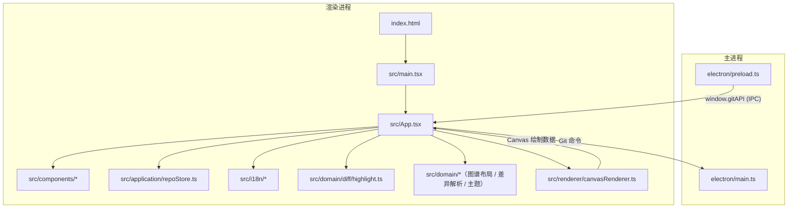
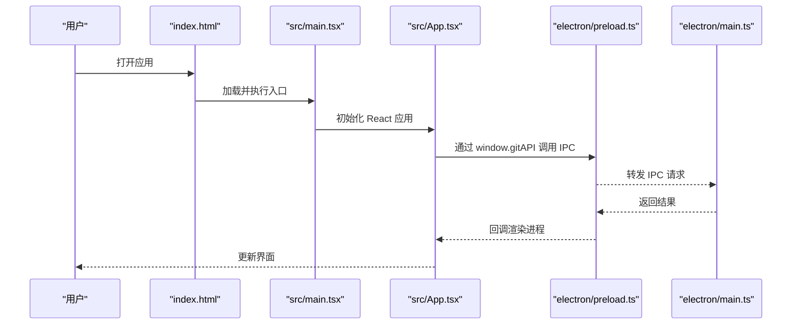
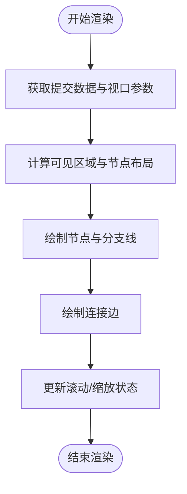
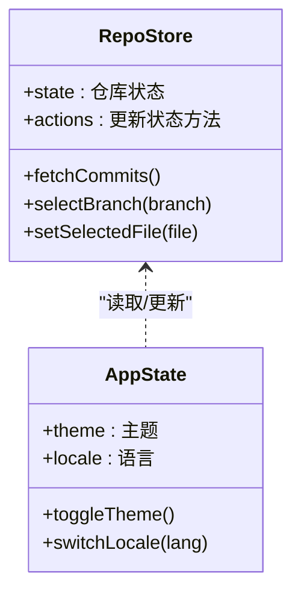
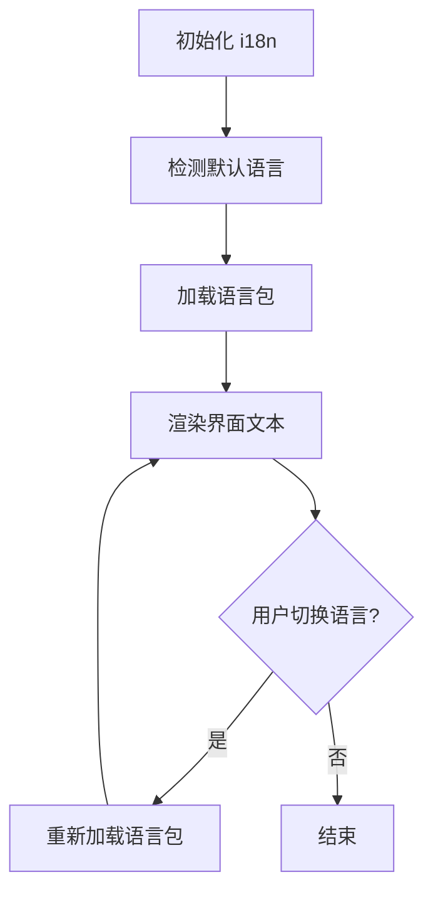
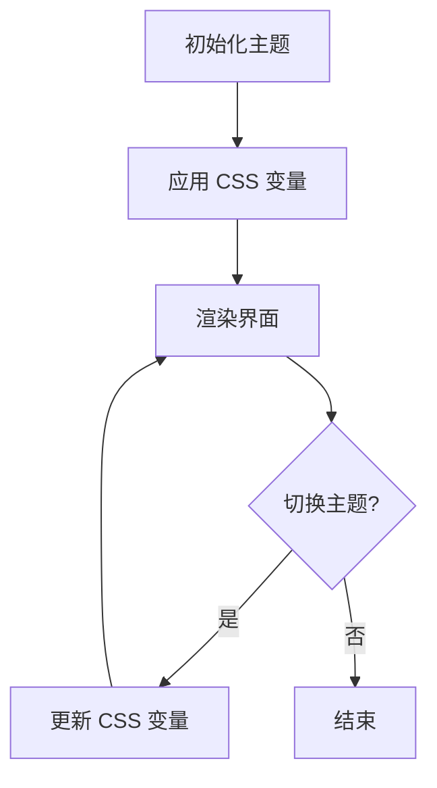
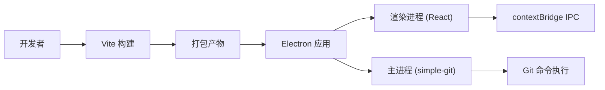

# 主页

<cite>
**本文引用的文件**   
- [package.json](file://package.json)
- [index.html](file://index.html)
- [src/main.tsx](file://src/main.tsx)
- [src/App.tsx](file://src/App.tsx)
- [electron/main.ts](file://electron/main.ts)
- [electron/preload.ts](file://electron/preload.ts)
- [vite.config.ts](file://vite.config.ts)
- [tsconfig.json](file://tsconfig.json)
- [tsconfig.main.json](file://tsconfig.main.json)
- [.gitignore](file://.gitignore)
- [README.md](file://README.md)
- [README_zh.md](file://README_zh.md)
- [wiki/Home.md](file://wiki/Home.md)
</cite>

## 目录
1. [简介](#简介)
2. [项目结构](#项目结构)
3. [核心组件](#核心组件)
4. [架构总览](#架构总览)
5. [详细组件分析](#详细组件分析)
6. [依赖分析](#依赖分析)
7. [性能考虑](#性能考虑)
8. [故障排查指南](#故障排查指南)
9. [结论](#结论)
10. [附录](#附录)

## 简介
ZenTree 是一个轻量级 Git GUI 客户端，基于 Electron 36 + React 18 + TypeScript 5.7 + Zustand 5 + simple-git 3.27 构建。提交历史通过 HTML5 Canvas 2D 渲染（不依赖第三方图表库），并采用视口裁剪以支持 10,000+ 提交的流畅展示。所有 Git 操作在 Electron 主进程执行，渲染进程通过 contextBridge IPC（window.gitAPI）与主进程通信；渲染进程禁用 nodeIntegration 并启用 contextIsolation，确保安全性。项目内置 10 种颜色主题（CSS 自定义属性）、完整的中英文国际化（实时切换），并通过 electron-builder 打包为 Windows（NSIS/便携版）、Linux（AppImage/deb）、macOS（DMG）安装包。

## 项目结构
本项目采用前后端分离的 Electron 应用结构，渲染层按 DDD（领域驱动设计）分层：
- electron/：Electron 主进程与预加载脚本（基础设施层）
- src/domain/：领域层，纯逻辑（图谱布局、差异解析、主题预设）
- src/application/：应用层，Zustand 状态与用例编排
- src/infrastructure/：渲染侧网关（gitBridge）
- src/components/、src/renderer/：界面层 React 组件与 Canvas 渲染
- src/i18n/、src/types/：国际化与跨层共享类型
- wiki/：项目文档与使用说明
- 根配置：Vite、TypeScript、打包与忽略规则
C --> D["src/components/*"]
C --> E["src/application/repoStore.ts"]
C --> F["src/i18n/*"]
C --> G["src/domain/diff/highlight.ts"]
C --> H["src/renderer/canvasRenderer.ts"]
I["electron/main.ts"] --> J["electron/preload.ts"]
J --> K["window.gitAPI (IPC)"]
K --> C
L["vite.config.ts"] --> B
M["tsconfig.json"] --> B
N["tsconfig.main.json"] --> I
O[".gitignore"] --> A
```

**图示来源**
- [index.html:1-200](file://index.html#L1-L200)
- [src/main.tsx:1-200](file://src/main.tsx#L1-L200)
- [src/App.tsx:1-200](file://src/App.tsx#L1-L200)
- [electron/main.ts:1-200](file://electron/main.ts#L1-L200)
- [electron/preload.ts:1-200](file://electron/preload.ts#L1-L200)
- [vite.config.ts:1-200](file://vite.config.ts#L1-L200)
- [tsconfig.json:1-200](file://tsconfig.json#L1-L200)
- [tsconfig.main.json:1-200](file://tsconfig.main.json#L1-L200)
- [.gitignore:1-200](file://.gitignore#L1-L200)

**章节来源**
- [package.json:1-200](file://package.json#L1-L200)
- [index.html:1-200](file://index.html#L1-L200)
- [src/main.tsx:1-200](file://src/main.tsx#L1-L200)
- [src/App.tsx:1-200](file://src/App.tsx#L1-L200)
- [electron/main.ts:1-200](file://electron/main.ts#L1-L200)
- [electron/preload.ts:1-200](file://electron/preload.ts#L1-L200)
- [vite.config.ts:1-200](file://vite.config.ts#L1-L200)
- [tsconfig.json:1-200](file://tsconfig.json#L1-L200)
- [tsconfig.main.json:1-200](file://tsconfig.main.json#L1-L200)
- [.gitignore:1-200](file://.gitignore#L1-L200)

## 核心组件
- 入口与路由
  - src/main.tsx：React 应用初始化与挂载
  - index.html：页面模板与资源引入
- 应用壳与布局
  - src/App.tsx：全局状态、主题、国际化与布局组合
- 主进程与预加载
  - electron/main.ts：Electron 主进程生命周期、窗口创建、IPC 注册
  - electron/preload.ts：安全桥接 window.gitAPI 暴露给渲染进程
- 构建与类型
  - vite.config.ts：开发/生产构建、路径别名、插件
  - tsconfig.json / tsconfig.main.json：渲染与主进程 TS 配置
  - .gitignore：忽略产物与敏感文件

**章节来源**
- [src/main.tsx:1-200](file://src/main.tsx#L1-L200)
- [src/App.tsx:1-200](file://src/App.tsx#L1-L200)
- [electron/main.ts:1-200](file://electron/main.ts#L1-L200)
- [electron/preload.ts:1-200](file://electron/preload.ts#L1-L200)
- [vite.config.ts:1-200](file://vite.config.ts#L1-L200)
- [tsconfig.json:1-200](file://tsconfig.json#L1-L200)
- [tsconfig.main.json:1-200](file://tsconfig.main.json#L1-L200)
- [.gitignore:1-200](file://.gitignore#L1-L200)

## 架构总览
整体采用“渲染进程 UI + 主进程 Git 能力”的双进程架构，通过预加载脚本建立最小化 IPC 接口。Canvas 渲染器独立于 React DOM，负责提交图的高效绘制。



**图示来源**
- [electron/main.ts:1-200](file://electron/main.ts#L1-L200)
- [electron/preload.ts:1-200](file://electron/preload.ts#L1-L200)
- [src/main.tsx:1-200](file://src/main.tsx#L1-L200)
- [src/App.tsx:1-200](file://src/App.tsx#L1-L200)
- [src/renderer/canvasRenderer.ts:1-200](file://src/renderer/canvasRenderer.ts#L1-L200)

## 详细组件分析

### 入口与初始化流程
- index.html 提供页面骨架与资源引用
- src/main.tsx 初始化 React 并挂载到 DOM
- src/App.tsx 组合主题、国际化、状态管理与各功能模块



**图示来源**
- [index.html:1-200](file://index.html#L1-L200)
- [src/main.tsx:1-200](file://src/main.tsx#L1-L200)
- [src/App.tsx:1-200](file://src/App.tsx#L1-L200)
- [electron/preload.ts:1-200](file://electron/preload.ts#L1-L200)
- [electron/main.ts:1-200](file://electron/main.ts#L1-L200)

**章节来源**
- [index.html:1-200](file://index.html#L1-L200)
- [src/main.tsx:1-200](file://src/main.tsx#L1-L200)
- [src/App.tsx:1-200](file://src/App.tsx#L1-L200)
- [electron/preload.ts:1-200](file://electron/preload.ts#L1-L200)
- [electron/main.ts:1-200](file://electron/main.ts#L1-L200)

### 提交图渲染（Canvas）
- 使用 HTML5 Canvas 2D 直接绘制提交节点与边
- 视口裁剪减少重绘范围，提升大仓库性能
- 与 React 状态解耦，仅接收必要数据帧进行绘制



**图示来源**
- [src/renderer/canvasRenderer.ts:1-200](file://src/renderer/canvasRenderer.ts#L1-L200)

**章节来源**
- [src/renderer/canvasRenderer.ts:1-200](file://src/renderer/canvasRenderer.ts#L1-L200)

### 状态管理（Zustand）
- 使用 Zustand 维护仓库状态（如当前分支、提交列表、选中文件等）
- 通过 actions 触发 Git 操作并更新 UI
- 与 i18n、主题系统协作，实现响应式界面



**图示来源**
- [src/application/repoStore.ts:1-200](file://src/application/repoStore.ts#L1-L200)
- [src/App.tsx:1-200](file://src/App.tsx#L1-L200)

**章节来源**
- [src/application/repoStore.ts:1-200](file://src/application/repoStore.ts#L1-L200)
- [src/App.tsx:1-200](file://src/App.tsx#L1-L200)

### 国际化（i18n）
- 支持中英文实时切换
- 文本集中管理，组件按需加载对应语言包
- 与主题系统并行工作，互不影响



**图示来源**
- [src/i18n/index.ts:1-200](file://src/i18n/index.ts#L1-L200)
- [src/i18n/en.ts:1-200](file://src/i18n/en.ts#L1-L200)
- [src/i18n/zh.ts:1-200](file://src/i18n/zh.ts#L1-L200)

**章节来源**
- [src/i18n/index.ts:1-200](file://src/i18n/index.ts#L1-L200)
- [src/i18n/en.ts:1-200](file://src/i18n/en.ts#L1-L200)
- [src/i18n/zh.ts:1-200](file://src/i18n/zh.ts#L1-L200)

### 主题系统（CSS 自定义属性）
- 通过 CSS 变量定义 10 套配色方案
- 运行时动态切换，无需刷新页面
- 与组件样式解耦，便于扩展新主题



**图示来源**
- [src/App.css:1-200](file://src/App.css#L1-L200)
- [src/theme.css:1-200](file://src/theme.css#L1-L200)

**章节来源**
- [src/App.css:1-200](file://src/App.css#L1-L200)
- [src/theme.css:1-200](file://src/theme.css#L1-L200)

## 依赖分析
- 运行时依赖
  - Electron：跨平台桌面应用框架
  - React + ReactDOM：UI 框架与渲染
  - TypeScript：类型系统与开发体验
  - Vite：构建与开发服务器
  - simple-git：Git 操作封装
  - Zustand：轻量状态管理
- 构建与打包
  - electron-builder：多平台安装包生成
  - tsconfig.*：分进程类型检查



**图示来源**
- [package.json:1-200](file://package.json#L1-L200)
- [vite.config.ts:1-200](file://vite.config.ts#L1-L200)
- [tsconfig.json:1-200](file://tsconfig.json#L1-L200)
- [tsconfig.main.json:1-200](file://tsconfig.main.json#L1-L200)

**章节来源**
- [package.json:1-200](file://package.json#L1-L200)
- [vite.config.ts:1-200](file://vite.config.ts#L1-L200)
- [tsconfig.json:1-200](file://tsconfig.json#L1-L200)
- [tsconfig.main.json:1-200](file://tsconfig.main.json#L1-L200)

## 性能考虑
- Canvas 渲染：避免 DOM 频繁更新，使用视口裁剪减少绘制量
- 状态管理：Zustand 最小化 re-render，按需订阅状态变化
- IPC 通信：批量传输数据，避免频繁小消息
- 构建优化：Vite 按需编译，生产环境启用代码分割与压缩

[本节为通用指导，不涉及具体文件分析]

## 故障排查指南
- 启动失败
  - 检查 Node.js 版本与依赖安装是否完整
  - 确认 Electron 主进程与渲染进程配置一致
- IPC 调用无效
  - 验证 preload 脚本是否正确暴露 window.gitAPI
  - 检查主进程 IPC 处理器是否注册
- 主题或语言未生效
  - 确认 CSS 变量与语言包路径正确
  - 查看控制台是否有资源加载错误
- 提交图渲染异常
  - 检查 Canvas 上下文初始化与尺寸设置
  - 验证提交数据格式与视口参数

[本节为通用指导，不涉及具体文件分析]

## 结论
ZenTree 以清晰的 Electron 双进程架构、高效的 Canvas 渲染与简洁的状态管理，提供了开箱即用的 Git GUI 体验。通过模块化设计与完善的文档体系，开发者可快速扩展功能或定制主题与国际化内容。

[本节为总结性内容，不涉及具体文件分析]

## 附录
- 快速开始与构建说明见 wiki/Home.md
- 组件与 API 参考见 wiki/Components.md 与 wiki/IPC-API.md
- 主题与国际化指南见 wiki/Theming.md 与 wiki/Internationalization.md

**章节来源**
- [wiki/Home.md:1-200](file://wiki/Home.md#L1-L200)
- [wiki/Components.md:1-200](file://wiki/Components.md#L1-L200)
- [wiki/IPC-API.md:1-200](file://wiki/IPC-API.md#L1-L200)
- [wiki/Theming.md:1-200](file://wiki/Theming.md#L1-L200)
- [wiki/Internationalization.md:1-200](file://wiki/Internationalization.md#L1-L200)